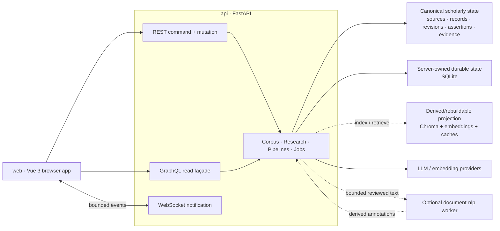

<!--
This file is part of DerridAI, a cELF-compliant research workspace
Copyright © 2026  Aaron John Schlosser, PhD

This program is free software: you can redistribute it and/or modify
it under the terms of the GNU Affero General Public License as
published by the Free Software Foundation, either version 3 of the
License, or (at your option) any later version.

This program is distributed in the hope that it will be useful,
but WITHOUT ANY WARRANTY; without even the implied warranty of
MERCHANTABILITY or FITNESS FOR A PARTICULAR PURPOSE.  See the
GNU Affero General Public License for more details.

You should have received a copy of the GNU Affero General Public License
along with this program.  If not, see <https://www.gnu.org/licenses/>.
-->

# DerridAI


[English](README.md) · [Français](README.fr.md) · [Español](README.es.md) · [Português](README.pt.md) · [Deutsch](README.de.md) · [Italiano](README.it.md) · [Magyar](README.hu.md) · [Русский](README.ru.md) · [हिन्दी](README.hi.md) · [বাংলা](README.bn.md) · [العربية](README.ar.md) · [简体中文](README.zh-CN.md)

DerridAI একটি local-first, provenance-preserving গবেষণা পরিবেশ, যা scholarly corpus তৈরি, পর্যালোচনা, অনুসন্ধান ও query করার জন্য তৈরি। একটি Docker application-এর মধ্যে এটি source ingestion, human-in-the-loop corpus construction, evidence-aware metadata enrichment, derived vector/search index এবং evidence-grounded retrieval-augmented generation (RAG) একত্র করে।

DerridAI একই সঙ্গে **cELF 1.0 — Capta-Enriched Lexical Format**-এর মূল reference implementation। cELF হলো AI-assisted documentary research-এর জন্য provenance-preserving information architecture। DerridAI source identity, Record identity ও revision, metadata assertion, evidence, generated claim এবং support binding আলাদা ও auditযোগ্য রাখে; এগুলোকে একটি opaque vector store-এ সমতল করে না।

বর্তমান সংস্করণ: **0.82.0 — Gloucester** ([release notes](docs/notes/0.82.0.md))। এই README Gloucester release-এর বিবরণ দেয়।

## বর্তমান `master`

নিচের সারাংশ Gloucester release-এর বিবরণ দেয়।

- **Corpus Builder এখন progressive Setup → Build → Review → Publish workflow।** এতে bounded concurrent enrichment, explicit corpus topology ও Record-size নির্বাচন, resumable/revision-aware review, persistent Record-local review queue, publication blocker-এর focused remediation session, repeatable metadata group, audio speaker assignment এবং verified preparation চলাকালে safe text review রয়েছে।
- **Metadata ও evidence processing কম model work করে কিন্তু শক্তিশালী semantics বজায় রাখে।** Deterministic/candidate-first routing, semantic identity ও value equivalence, support-validated evidence cascade v2, structured-completion repair/retry classification এবং incremental Metadata Memory reconciliation latency কমায়—retrieval relevance বা malformed output-কে evidence হিসেবে প্রতিষ্ঠা না করেই।
- **Pipeline Studio executable computation-কে স্পষ্টভাবে model করে।** Server-owned purpose, strategy family, scholarly effect, typed port, resolved wiring, stage trace, scope/complexity metric, tunable retrieval parameter এবং non-persistent comparison এখন Search, Research, reviewer evidence, recovery, segmentation ও enrichment-এর আরও বেশি path কভার করে।
- **Works portable research site publish করতে পারে।** Static export DerridAI SDK-এর সঙ্গে dedicated Vue runtime যুক্ত করে browsing, annotation, browser semantic indexing, reader-configured provider এবং evidence-linked citationসহ Research সরবরাহ করে; export কখনও canonical corpus state হয়ে যায় না।
- **Realtime invalidation ও progressive loading আরও বেশি polling এবং blank-page refresh-এর জায়গা নিচ্ছে।** Works, Record, Search, Research, Response Library, Languages, Relationships, Accounts/Roles, Metadata Memory এবং সংশ্লিষ্ট surface দরকারি content ধরে রাখে, failure আলাদা করে, local retry দেয় এবং stale response বাতিল করে।
- **Frontend legacy runtime ধাপে ধাপে সরিয়ে দিচ্ছে।** Router-owned navigation, Vue-hosted dialog/notification, shared domain/state module, Pinia slice এবং extracted helper coupling কমায়; অবশিষ্ট compatibility code ইচ্ছাকৃতভাবে isolated রাখা হয়েছে।
- **cELF ও developer infrastructure আরও কঠোর হয়েছে।** Specification product-neutral ও profile/provenance-oriented, generalized `EvidenceRef` locator semantics-সহ; critical code boundary-এর architecture map যোগ হয়েছে; CI/pre-push selection, repository hygiene এবং copyright enforcement শক্তিশালী হয়েছে।

## DerridAI কী করে

- **বিভিন্ন ধরনের source acquire ও ingest করে।** PDF, plain text, RTF, DOCX, image ও audio upload করা যায়; URL ও Project Gutenberg material import করা যায়; অথবা Corpus Capture দিয়ে Wikidata, Project Gutenberg ও Wikisource provider adapter থেকে work আবিষ্কার ও acquire করা যায়। Ingestion media-specific safety/resource limit প্রয়োগ করে এবং extractor/tool/version provenance সংরক্ষণ করে।
- **Media-aware workflow দিয়ে corpus তৈরি করে।** Corpus Builder source registration, extraction/transcription, source-unit mapping, structure/segmentation, enrichment, Record construction, review ও publication আলাদা stage-এ রাখে। Control ও evidence coordinate source medium অনুযায়ী বদলে যায়; PDF/page ধারণা সব source-এর ওপর চাপিয়ে দেওয়া হয় না।
- **cELF provenance ও field authority সংরক্ষণ করে।** Canonical `FieldAssertion` record derivation, evaluation, authority, value state, confidence, evidence, actor/model, stable field identity এবং Record revision আলাদা করে রাখে। Human confirmation model বা deterministic provenance মুছে দেয় না।
- **Evidence context-এর মধ্যে Record review করে।** Reviewer text ও metadata edit করতে পারেন, source span ও অন্য Record-এর evidence দেখতে পারেন, revision compare করতে পারেন, semantic map ও relationship view ব্যবহার করতে পারেন, suggestion accept/reject করতে পারেন এবং auditযোগ্য decision নিয়ে publish করতে পারেন।
- **Configurable metadata schema ও reviewed precedent ব্যবহার করে।** Schema stable field, type, controlled value, evidence/review rule, POS/NER hint, field scope, model guidance ও retrieval policy নির্ধারণ করে। Reviewed example পরের enrichment-এর জন্য bounded, evidence-linked precedent হতে পারে, কিন্তু canonical reviewer decision প্রতিস্থাপন করে না।
- **Optional Document Intelligence যোগ করে।** Provider-neutral derived analysis layer entity, coreference, quotation-speaker information এবং semantic-content relationship যোগ করতে পারে। ছোট English ও French spaCy model bundled; অন্য digest-verified language pack administrator-managed; isolated BookNLP worker optional English enhancement হিসেবে থাকে। এই annotation rebuildable analysis—source evidence বা corpus authority নয়।
- **Derived projection search করে কিন্তু corpus-এর সঙ্গে মিশিয়ে ফেলে না।** ChromaDB rebuildable semantic/search projection ও cache রাখে, embedded বা HTTP-server mode-এ। প্রয়োজনমতো dense, lexical, MMR, reciprocal-rank fusion, filter, language routing এবং bounded cross-encoder reranking ব্যবহার করা যায়।
- **Evidence-grounded Research/RAG চালায়।** Research hybrid retrieval, reranking, selected-evidence mode, evidence budget, optional Record-size-aware retrieval sizing, streamed/cancellable generation, deterministic citation rendering, claim/support persistence, claim validation, response/claim memory এবং LLM grading সমর্থন করে। Provenance-incomplete Record evidence থেকে বাদ পড়ে; তাকে নিঃশব্দে valid support ধরা হয় না।
- **Portable research site publish করে।** Works immutable static snapshot export করতে পারে, যাতে Works/Record browsing, metadata filter, local annotation, keyword/semantic/hybrid search, browser-ready vector বা local Transformers.js indexing, reader-configured generation provider এবং evidence-grounded Research থাকে। Generated answer-এর deterministic inline citation সংশ্লিষ্ট evidence-এর সঙ্গে link করা হয়।
- **AI pipeline inspect ও configure করে।** Pipeline Studio server-owned workflow purpose, strategy family ও scholarly effect আলাদা করে; typed stage input/output, resolved wiring, versioned definition ও assignment, trace, scope/latency/complexity metric, retrieval tuning parameter, non-persistent comparison এবং fixed-case benchmark দেখায়। Provenance/authority gate structural constraint হিসেবেই থাকে।
- **ভিন্ন কাজের জন্য ভিন্ন API transport দেয়।** REST command ও mutation-এর জন্য; read-only cELF-aware GraphQL façade typed read compose করে; authenticated WebSocket plane realtime operation notification দেয়। Realtime message কখনও canonical state নয় এবং client REST/GraphQL থেকে resynchronize করতে পারে।
- **Controlled multi-user research সমর্থন করে।** Built-in Administrator ও Researcher role-এর সঙ্গে custom researcher-safe role UI ও API—দুই জায়গাতেই enforce করা হয়। Researcher-facing source text API boundary-তে সীমিত হয়, job owner-scoped থাকে এবং administrator-only corpus/system mutation inaccessible থাকে।
- **Long-running work observable রাখে এবং data বদলালেও page ব্যবহারযোগ্য রাখে।** Corpus build, LLM review, RAG, grading, import, model/language-pack work ও vector upsert cancellable operation হিসেবে দেখা যায়, durable snapshot/history ও realtime progress-সহ। Resource-change notification canonical refetch trigger করে; WebSocket state-কে source of truth বানায় না।
- **Accessible, multilingual interface দেয়।** English ও Canadian French first-class UI locale এবং key parity enforced; README আরও বেশি ভাষায় রয়েছে। WCAG 2.2 AA, keyboard access, visible focus, reflow, reduced motion, forced colors/high contrast এবং long-string/localization check quality criteria। Help Center search-first, role-aware ও bookmarkable; এতে task shortcut, route guide, workflow FAQ এবং technical/plain-language glossary রয়েছে।
- **Research environment backup করে।** Backup/restore workspace, audit history, provider profile, source asset, system/provenance state এবং Chroma collection/embedding কভার করে।

সম্পূর্ণ feature reference-এর জন্য [User Guide](docs/USER_GUIDE.md) দেখুন।

## cELF traceability model

DerridAI-এর scholarly data model authoritative documentary/scholarly state এবং rebuildable computational projection-এর মধ্যে cELF-এর পার্থক্য অনুসরণ করে। পূর্ণ traceability-তে conceptual path হলো:

```text
SourceDocument
  -> SourceSpan
  -> Record
  -> RecordRevision
  -> FieldAssertion
  -> Evidence Acquisition
  -> EvidenceRef
  -> EvidencePacket
  -> GenerationRun
  -> GeneratedClaim
  -> SupportBinding
```

এর ফলে generated claim থেকে support, evidence, Record revision, SourceSpan এবং SourceDocument পর্যন্ত উল্টো দিকে audit করা যায়। Embedding, retrieval rank, reranker score, cache, UI state এবং operation-specific value derived state-ই থাকে; এগুলো source Record-এর intrinsic property হয়ে যায় না।

Normative cELF 1.0 specification-এর জন্য [SPECIFICATION.md](SPECIFICATION.md) দেখুন।

## Architecture

DerridAI-এর top-level dependency ও authority boundary:



Subsystem-এর ভেতরে কাজ করলে আরও নির্দিষ্ট local map ব্যবহার করুন:

- [Backend application map](api/app/README.md)
- [Computational pipelines](api/app/pipelines/README.md)
- [Frontend workspace](web/README.md)
- [Frontend application map](web/src/README.md)
- [Frontend domain layer](web/src/domain/README.md)
- [Frontend components](web/src/components/README.md)
- [Frontend API clients](web/src/api/README.md)
- [Corpus Builder frontend feature](web/src/features/corpus-builder/README.md)
- [Corpus Builder components](web/src/components/corpus-builder/README.md)
- [Pipeline Studio components](web/src/components/pipelines/README.md)
- [Frontend test architecture](web/tests/README.md)

### Runtime service

- `web` — Vue 3, TypeScript, Pinia, Vue Router, Vite, PDF.js ও nginx। Browser application; `/api/` proxy করে এবং REST, GraphQL ও realtime notification ব্যবহার করে। Storybook opt-in development profile।
- `api` — Python 3.12, FastAPI, Strawberry GraphQL, ChromaDB client, PyMuPDF, sentence-transformers ও spaCy। Authentication, source/corpus operation, cELF read, provenance, RAG, pipeline, job ও system state-এর authoritative application boundary।
- `document-nlp` — English Document Intelligence-এর optional isolated BookNLP worker। Bounded reviewed text পায় এবং corpus authority নেই।
- `chroma` — optional HTTP Chroma server। Embedded `PersistentClient` default; দুই mode-ই derived search/vector projection রাখে।
- `ollama` — optional local Ollama service। DerridAI host-এ চলা Ollama বা configured OpenAI-compatible endpoint-ও ব্যবহার করতে পারে।

Default Compose stack `web` ও `api` চালু করে; অন্য service opt-in profile বা external provider।

### Authority ও persistence

DerridAI সব store-কে সমান authority দেয় না:

- **Canonical scholarly state** — source asset/identity, Record ও revision, FieldAssertion, review decision, exact evidence/support binding এবং publication state।
- **Server-owned durable state** — authentication এবং `./data`-এর SQLite-এ system/provenance/job/pipeline state।
- **Derived/rebuildable state** — Chroma index, embedding, metadata-exemplar projection, retrieval score, semantic-content projection, Document Intelligence output ও cache।
- **Browser workspace state** — local working-set preference ও unsaved workspace state; corpus authority থেকে আলাদা।

### Transport split

- **REST**: সব command ও mutation, যেমন upload, review decision, job, publication, administration, backup ও restore।
- **GraphQL**: `POST /api/graphql`-এ read-only cELF-aware typed query façade; mutation বা subscription root নেই।
- **WebSocket**: `WS /api/ws/events`-এ authenticated realtime notification plane; কখনও source of truth নয়।

বিস্তারিত module ownership, persistence boundary ও data flow-এর জন্য [Architecture](docs/ARCHITECTURE.md), [GraphQL](docs/GRAPHQL.md) এবং [Realtime](docs/REALTIME.md) দেখুন।

## শুরু করা

এগুলো clean checkout-এর supported step।

### 1. Prerequisite

Git, `docker compose` command-সহ Docker Engine/Desktop এবং একটি LLM endpoint install করুন। Default configuration host-এ Ollama আশা করে।

Default model:

```text
gemma4:e2b
bge-m3:latest
```

### 2. Clone ও configure

```bash
git clone https://github.com/ajschlosser/DerridAI.git
cd DerridAI
cp .env.example .env
```

PowerShell:

```powershell
Copy-Item .env.example .env
```

Docker Desktop + WSL-এ `.env`-এর `HOST_UID` ও `HOST_GID`-কে `id -u` ও `id -g`-এর output দিন, যাতে bind-mounted SQLite/Chroma file host user-এর ownership-এ থাকে।

`CHROMA_DATA_ROOT`, `AUTH_DB_PATH`, `SYSTEM_DB_PATH` বা `CHROMA_PATH`-এর মতো DerridAI test-storage variable shell-এ global export করবেন না। Compose file-এর value container-এ পাঠানোর আগে exported variable interpolate করে।

### 3. Configured model উপলভ্য করুন

Host-এ Ollama চললে:

```bash
ollama pull gemma4:e2b
ollama pull bge-m3:latest
```

Default `.env.example`:

```env
OLLAMA_BASE_URL=http://host.docker.internal:11434
OLLAMA_MODEL=gemma4:e2b
OLLAMA_EMBED_MODEL=bge-m3:latest
EMBEDDING_PROVIDER=ollama
```

অথবা optional Compose Ollama service:

```bash
docker compose --profile ollama up -d ollama
docker compose exec ollama ollama pull gemma4:e2b
docker compose exec ollama ollama pull bge-m3:latest
```

তারপর `.env`-এ `OLLAMA_BASE_URL=http://ollama:11434` সেট করুন।

### 4. DerridAI চালু করুন

```bash
docker compose config --quiet
docker compose up -d --build
```

Default endpoint:

- Application: <http://localhost:8181>
- API: <http://127.0.0.1:8000>
- OpenAPI docs: <http://127.0.0.1:8000/docs>

প্রথম launch-এ browser-এ initial Administrator account তৈরি করুন। DerridAI কোনো default credential দেয় না।

### 5. Installation যাচাই

```bash
docker compose ps
curl -fsS http://127.0.0.1:8000/api/live
```

Liveness response-এ `"ok": true`, application version এবং উপলভ্য হলে baked git commit থাকা উচিত।

আরও বিস্তৃত diagnostic:

```bash
./scripts/diagnose.sh
```

PowerShell:

```powershell
.\scripts\diagnose.ps1
```

### 6. Optional service

```bash
# Local Ollama service
docker compose --profile ollama up -d ollama

# Chroma HTTP server (তারপর CHROMA_MODE=http সেট করুন)
docker compose --profile chroma up -d chroma

# English BookNLP Document Intelligence enhancement
docker compose --profile document-nlp up -d document-nlp

# Storybook development surface
docker compose --profile dev up storybook
```

NLP language pack enable বা install করার আগে [Document Intelligence](docs/DOCUMENT_INTELLIGENCE.md) পড়ুন।

### 7. Stop বা rebuild

```bash
docker compose down

# পরিবর্তন pull করার পরে
docker compose down
docker compose up -d --build
```

পুরনো release `data/`-এর নিচে root-owned file রেখে গেলে supported Unix-like host-এ `./scripts/fix-data-permissions.sh` চালান।

## Developer setup

CI Python 3.12 ও Node 22 ব্যবহার করে।

Backend/test environment:

```bash
python3.12 -m venv .venv
. .venv/bin/activate
python -m pip install --upgrade pip
pip install -r api/requirements-dev.txt
```

Frontend environment:

```bash
cd web
npm ci --no-audit --no-fund
npx playwright install chromium
cd ..
```

দ্রুত local quality gate:

```bash
ruff check api/app tests scripts/check_frontend_api_contract.py scripts/check_frontend_graphql_contract.py
mypy
python -m compileall -q api/app
pytest -q -n auto --dist=worksteal \
  --ignore=tests/test_frontend_api_contract.py \
  --ignore=tests/test_frontend_graphql_contract.py
pytest -q -m contract tests/test_frontend_api_contract.py tests/test_frontend_graphql_contract.py

cd web
npm run format:repo:check
npm run lint
npm run typecheck
npm run typecheck:tests
npm run test:unit
npm run build:ci
```

`web/` থেকে `npm run format:repo` চালালে repository-র সব Prettier-supported source, configuration ও documentation file format হয়। Generated legacy DOM snapshot HTML ইচ্ছাকৃতভাবে বাদ থাকে।

Browser coverage, Storybook, CI parity এবং contribution rule-এর জন্য [CONTRIBUTING.md](CONTRIBUTING.md) দেখুন।

## Repository map

- `api/app/` — FastAPI backend: source/corpus workflow, cELF read service, GraphQL, realtime, provenance, pipeline, RAG, provider, persistence ও job।
- `web/src/` — Vue 3 application: view, component, Pinia store, routing, API client, realtime client, domain module এবং ক্রমশ ছোট ও isolated legacy compatibility layer।
- `web/sdk/` — framework-neutral TypeScript SDK: publication loading, local retrieval, citation, annotation, provider injection ও Research।
- `web/site/` — portable research-site runtime-এর Vue entrypoint ও compatibility adapter।
- `booknlp-worker/` — optional isolated BookNLP Document Intelligence worker।
- `tests/` — backend, regression, contract, release-consistency ও architecture test।
- `web/tests/frontend/` — Vitest component/domain test।
- `web/tests/e2e/` — Playwright application, Storybook, accessibility ও characterization coverage।
- `docs/` — current architecture/domain contract ও historical release note।
- `data/` — local runtime state; placeholder ছাড়া Git ignore করে। এর content commit করবেন না।

## Documentation

বর্তমান behavior বর্ণনা করে এমন document দিয়ে শুরু করুন:

- [User Guide](docs/USER_GUIDE.md) — feature ও workflow reference
- [Architecture](docs/ARCHITECTURE.md) — runtime boundary, authority, persistence ও data flow
- [cELF 1.0 specification](SPECIFICATION.md) — normative information model ও conformance requirement
- [Project context](docs/PROJECT_CONTEXT.md) — scholarly rationale এবং implemented/intended capability
- [GraphQL](docs/GRAPHQL.md) — read-only cELF query façade
- [Realtime](docs/REALTIME.md) — WebSocket notification protocol ও resynchronization
- [Document Intelligence](docs/DOCUMENT_INTELLIGENCE.md) — derived linguistic analysis ও language pack
- [Source ingestion](docs/INGESTION_VALIDATION.md) — safety, resource limit ও extraction fidelity
- [Metadata schemas](docs/METADATA_SCHEMAS.md) — configurable field contract ও model guidance
- [Metadata memory](docs/METADATA_MEMORY.md) — reviewed precedent ও authority boundary
- [FieldAssertion migration](docs/FIELD_ASSERTION_MIGRATION.md) — canonical assertion model ও compatibility work
- [Contributing](CONTRIBUTING.md) এবং [AGENTS.md](AGENTS.md) — development rule ও quality gate

Release history [CHANGELOG.md](CHANGELOG.md) এবং `docs/notes/<version>.md`-এ রয়েছে। Version-specific release note historical record; current architecture বা backlog documentation নয়।

## License

DerridAI [GNU Affero General Public License v3.0](LICENSE)-এর অধীনে licensed।

Copyright © 2026 Aaron John Schlosser, PhD. Application-এ © 2026 The New England Transcendental Club of California-ও প্রদর্শিত হয়।
