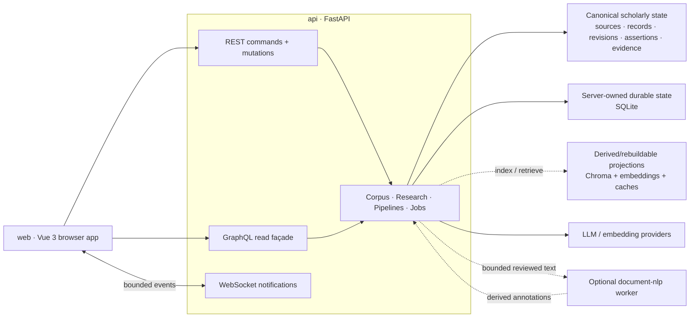

<!--
This file is part of DerridAI, a cELF-compliant research workspace
Copyright © 2026  Aaron John Schlosser, PhD

This program is free software: you can redistribute it and/or modify
it under the terms of the GNU Affero General Public License as
published by the Free Software Foundation, either version 3 of the
License, or (at your option) any later version.

This program is distributed in the hope that it will be useful,
but WITHOUT ANY WARRANTY; without even the implied warranty of
MERCHANTABILITY or FITNESS FOR A PARTICULAR PURPOSE.  See the
GNU Affero General Public License for more details.

You should have received a copy of the GNU Affero General Public License
along with this program.  If not, see <https://www.gnu.org/licenses/>.
-->

# DerridAI


[English](README.md) · [Français](README.fr.md) · [Español](README.es.md) · [Deutsch](README.de.md) · [Italiano](README.it.md) · [Magyar](README.hu.md) · [Русский](README.ru.md) · [हिन्दी](README.hi.md) · [العربية](README.ar.md)

DerridAI is a local-first, provenance-preserving research environment for building, reviewing, searching, and querying scholarly corpora. It combines source ingestion, human-in-the-loop corpus construction, evidence-aware metadata enrichment, derived vector/search indexes, and evidence-grounded retrieval-augmented generation (RAG) in one Docker application.

DerridAI is also the originating reference implementation of **cELF 1.0 — the Capta-Enriched Lexical Format**, a provenance-preserving information architecture for AI-assisted documentary research. The implementation keeps source identity, record identity and revision, metadata assertions, evidence, generated claims, and support bindings separately inspectable instead of flattening them into one opaque vector store.

Current version: **0.81.0 — Fall River** ([release notes](docs/notes/0.81.0.md)). This README describes the Fall River architecture on the current `master` branch.

## What DerridAI does

- **Acquire and ingest heterogeneous sources.** Upload PDF, plain text, RTF, DOCX, images, and audio; import URLs and Project Gutenberg material; or use Corpus Capture to discover and acquire works through provider adapters such as Wikidata, Project Gutenberg, and Wikisource. Ingestion applies medium-specific safety/resource limits and preserves extractor/tool/version provenance.
- **Build corpora with media-aware workflows.** Corpus Builder separates source registration, extraction/transcription, source-unit mapping, structure/segmentation, enrichment, record construction, review, and publication. Controls and evidence coordinates adapt to the source medium instead of applying PDF/page concepts to everything.
- **Preserve cELF provenance and field authority.** Canonical `FieldAssertion` records distinguish derivation, evaluation, authority, value state, confidence, evidence, actor/model, stable field identity, and record revision. Human confirmation does not erase model or deterministic provenance.
- **Review records with evidence in context.** Reviewers can edit text and metadata, inspect source spans and other-record evidence, compare revisions, use semantic maps and relationship views, accept or reject suggestions, and publish with auditable decisions. Optimistic review saves keep the interface responsive while conflicting same-record writes are serialized.
- **Use configurable metadata schemas and reviewed precedent.** Schemas define stable fields, types, controlled values, evidence/review rules, POS/NER hints, field scope, model guidance, and retrieval policy. Reviewed examples become bounded, evidence-linked precedents for later enrichment without replacing canonical reviewer decisions.
- **Add optional Document Intelligence.** A provider-neutral derived analysis layer can add entities, coreference, quotation-speaker information, and semantic-content relationships. spaCy language packs provide the baseline; an isolated BookNLP worker is available as an optional English enhancement. These annotations remain rebuildable analysis, not source evidence or corpus authority.
- **Search derived projections without confusing them with the corpus.** ChromaDB stores rebuildable semantic/search projections and caches, using embedded or HTTP-server modes. Dense, lexical, MMR, reciprocal-rank fusion, filters, language routing, and bounded cross-encoder reranking are available where appropriate.
- **Run evidence-grounded Research/RAG.** Research supports hybrid retrieval, reranking, selected-evidence mode, evidence budgets, streamed/cancellable generation, deterministic citation rendering, claim/support persistence, claim validation, response/claim memory, and LLM grading. Provenance-incomplete records are excluded from evidence rather than silently treated as valid support.
- **Inspect and configure AI pipelines.** Pipeline Studio exposes versioned pipeline definitions, assignments, run traces, stage-level latency/error/fallback metrics, point-of-use traces, non-persistent Research A/B comparison, and fixed-case Research benchmark runs. Retrieval, memory, metadata-precedent, and reviewer-evidence stages can be made explicit while provenance/authority gates remain structural constraints.
- **Expose distinct API transports for distinct jobs.** REST owns commands and mutations; a read-only cELF-aware GraphQL façade composes typed reads; an authenticated WebSocket plane sends realtime operation notifications. Realtime messages are never canonical state and clients can resynchronize from REST/GraphQL.
- **Support controlled multi-user research.** Built-in Administrator and Researcher roles plus custom researcher-safe roles are enforced by both UI and API. Researcher-facing source text is summarized at the API boundary, jobs are owner-scoped, and administrator-only corpus/system mutations remain inaccessible.
- **Keep long-running work observable.** Corpus builds, LLM review, RAG, grading, imports, model/language-pack work, and vector upserts surface as cancellable operations with durable snapshots/history and realtime progress. Interrupted in-process work is marked failed after restart rather than silently replayed.
- **Ship an accessible, multilingual interface.** English and Canadian French are first-class UI locales with enforced key parity; README coverage is broader. WCAG 2.2 AA, keyboard access, visible focus, reflow, reduced motion, forced-colors/high-contrast behavior, and long-string/localization checks are release criteria. The Help Center provides route-specific guides, workflow FAQs, and a plain-language glossary.
- **Back up the research environment.** Backup/restore covers workspaces, audit history, provider profiles, source assets, system/provenance state, and Chroma collections/embeddings.

See the [User Guide](docs/USER_GUIDE.md) for the full feature reference.

## cELF traceability model

DerridAI's scholarly data model follows the cELF distinction between authoritative documentary/scholarly state and rebuildable computational projections. At full traceability, the conceptual path is:

```text
SourceDocument
  -> SourceSpan
  -> Record
  -> RecordRevision
  -> FieldAssertion
  -> Evidence Acquisition
  -> EvidenceRef
  -> EvidencePacket
  -> GenerationRun
  -> GeneratedClaim
  -> SupportBinding
```

This means an answer can be audited backward from a generated claim to its support, evidence, record revision, source span, and source document. Embeddings, retrieval rank, reranker scores, caches, UI state, and other operation-specific values remain derived state; they do not become intrinsic properties of the source record.

See [SPECIFICATION.md](SPECIFICATION.md) for the normative cELF 1.0 specification.

## Architecture

DerridAI's top-level dependency and authority boundaries are:



For developers working inside a subsystem, the local maps are more specific than this overview:

- [Backend application map](api/app/README.md)
- [Computational pipelines](api/app/pipelines/README.md)
- [Frontend workspace](web/README.md)
- [Frontend application map](web/src/README.md)
- [Frontend domain layer](web/src/domain/README.md)
- [Frontend components](web/src/components/README.md)
- [Frontend API clients](web/src/api/README.md)
- [Corpus Builder frontend feature](web/src/features/corpus-builder/README.md)
- [Corpus Builder components](web/src/components/corpus-builder/README.md)
- [Pipeline Studio components](web/src/components/pipelines/README.md)
- [Frontend test architecture](web/tests/README.md)

### Runtime services

- `web` — Vue 3, TypeScript, Pinia, Vue Router, Vite, PDF.js, and nginx. It is the browser application, proxies `/api/`, and consumes REST, GraphQL, and realtime notifications. Storybook is an opt-in development profile.
- `api` — Python 3.12, FastAPI, Strawberry GraphQL, the ChromaDB client, PyMuPDF, sentence-transformers, and spaCy. It is the authoritative application boundary for authentication, source/corpus operations, cELF reads, provenance, RAG, pipelines, jobs, and system state.
- `document-nlp` — an optional isolated BookNLP worker for English Document Intelligence. It receives bounded reviewed text and has no corpus authority.
- `chroma` — an optional HTTP Chroma server. Embedded `PersistentClient` remains the default; both modes store derived search/vector projections.
- `ollama` — an optional local Ollama service. DerridAI can instead use Ollama already running on the host or any configured OpenAI-compatible endpoint.

The default Compose stack starts `web` and `api`; the other services are opt-in profiles or external providers.

### Authority and persistence

DerridAI deliberately does not treat every store as equally authoritative:

- **Canonical scholarly state** — source assets/identity, records and revisions, field assertions, review decisions, exact evidence/support bindings, and publication state.
- **Server-owned durable state** — authentication plus system/provenance/job/pipeline state in SQLite under `./data`.
- **Derived/rebuildable state** — Chroma indexes, embeddings, metadata-exemplar projections, retrieval scores, semantic-content projections, Document Intelligence output, and caches.
- **Browser workspace state** — local working-set preferences and unsaved workspace state, kept separate from corpus authority.

### Transport split

- **REST**: every command and mutation, including uploads, review decisions, jobs, publication, administration, backup, and restore.
- **GraphQL**: read-only cELF-aware typed query façade at `POST /api/graphql`; no mutation or subscription root.
- **WebSocket**: authenticated realtime notification plane at `WS /api/ws/events`; never a source of truth.

For detailed module ownership, persistence boundaries, and data flow, see [Architecture](docs/ARCHITECTURE.md), [GraphQL](docs/GRAPHQL.md), and [Realtime](docs/REALTIME.md).

## Getting started

These are the supported clean-checkout steps.

### 1. Prerequisites

Install Git, Docker Engine/Desktop with the `docker compose` command, and an LLM endpoint. The default configuration expects Ollama on the host.

Default models:

```text
gemma4:e2b
bge-m3:latest
```

### 2. Clone and configure

```bash
git clone https://github.com/ajschlosser/DerridAI.git
cd DerridAI
cp .env.example .env
```

PowerShell:

```powershell
Copy-Item .env.example .env
```

On Docker Desktop with WSL, set `HOST_UID` and `HOST_GID` in `.env` to the output of `id -u` and `id -g` so bind-mounted SQLite/Chroma files remain owned by your host user.

Do not export DerridAI test-storage variables such as `CHROMA_DATA_ROOT`, `AUTH_DB_PATH`, `SYSTEM_DB_PATH`, or `CHROMA_PATH` globally in your shell. Compose interpolates exported variables before values from the file are passed into the container.

### 3. Make the configured models available

For Ollama already running on the host:

```bash
ollama pull gemma4:e2b
ollama pull bge-m3:latest
```

The default `.env.example` uses:

```env
OLLAMA_BASE_URL=http://host.docker.internal:11434
OLLAMA_MODEL=gemma4:e2b
OLLAMA_EMBED_MODEL=bge-m3:latest
EMBEDDING_PROVIDER=ollama
```

Or use the optional Compose Ollama service:

```bash
docker compose --profile ollama up -d ollama
docker compose exec ollama ollama pull gemma4:e2b
docker compose exec ollama ollama pull bge-m3:latest
```

Then set `OLLAMA_BASE_URL=http://ollama:11434` in `.env`.

### 4. Start DerridAI

```bash
docker compose config --quiet
docker compose up -d --build
```

Default endpoints:

- Application: <http://localhost:8181>
- API: <http://127.0.0.1:8000>
- OpenAPI docs: <http://127.0.0.1:8000/docs>

On first launch, create the initial administrator account in the browser. DerridAI ships no default credentials.

### 5. Verify the installation

```bash
docker compose ps
curl -fsS http://127.0.0.1:8000/api/live
```

The liveness response should contain `"ok": true`, the application version, and the baked git commit when available.

For a broader diagnostic:

```bash
./scripts/diagnose.sh
```

PowerShell:

```powershell
.\scripts\diagnose.ps1
```

### 6. Optional services

```bash
# Local Ollama service
docker compose --profile ollama up -d ollama

# Chroma HTTP server (then set CHROMA_MODE=http)
docker compose --profile chroma up -d chroma

# English BookNLP Document Intelligence enhancement
docker compose --profile document-nlp up -d document-nlp

# Storybook development surface
docker compose --profile dev up storybook
```

See [Document Intelligence](docs/DOCUMENT_INTELLIGENCE.md) before enabling or installing NLP language packs.

### 7. Stop or rebuild

```bash
docker compose down

# after pulling changes
docker compose down
docker compose up -d --build
```

If an older release left root-owned files under `data/`, run `./scripts/fix-data-permissions.sh` on supported Unix-like hosts.

## Developer setup

CI uses Python 3.12 and Node 22.

Backend/test environment:

```bash
python3.12 -m venv .venv
. .venv/bin/activate
python -m pip install --upgrade pip
pip install -r api/requirements-dev.txt
```

Frontend environment:

```bash
cd web
npm ci --no-audit --no-fund
npx playwright install chromium
cd ..
```

Fast local quality gates:

```bash
ruff check api/app tests scripts/check_frontend_api_contract.py
mypy
pytest -q -n auto --dist=worksteal --ignore=tests/test_frontend_api_contract.py
pytest -q -m contract tests/test_frontend_api_contract.py

cd web
npm run format:repo:check
npm run lint
npm run typecheck
npm run typecheck:tests
npm run test:unit
npm run build
```

Use `npm run format:repo` from `web/` to format every Prettier-supported source, configuration, and documentation file in the repository. Generated legacy DOM snapshot HTML is intentionally excluded.

For browser coverage, Storybook, CI parity, and contribution rules, see [CONTRIBUTING.md](CONTRIBUTING.md).

## Repository map

- `api/app/` — FastAPI backend: source/corpus workflows, cELF read services, GraphQL, realtime, provenance, pipelines, RAG, providers, persistence, and jobs.
- `web/src/` — Vue 3 application: views, components, Pinia stores, routing, API clients, realtime client, domain modules, and the remaining legacy compatibility layer.
- `booknlp-worker/` — optional isolated BookNLP Document Intelligence worker.
- `tests/` — backend, regression, contract, release-consistency, and architecture tests.
- `web/tests/frontend/` — Vitest component/domain tests.
- `web/tests/e2e/` — Playwright application, Storybook, accessibility, and characterization coverage.
- `docs/` — current architecture/domain contracts and historical release notes.
- `data/` — local runtime state; git-ignored except placeholders. Never commit its contents.

## Documentation

Start with the documents describing current behavior:

- [User Guide](docs/USER_GUIDE.md) — feature and workflow reference
- [Architecture](docs/ARCHITECTURE.md) — runtime boundaries, authority, persistence, and data flow
- [cELF 1.0 specification](SPECIFICATION.md) — normative information model and conformance requirements
- [Project context](docs/PROJECT_CONTEXT.md) — scholarly rationale and implemented-versus-intended capabilities
- [GraphQL](docs/GRAPHQL.md) — read-only cELF query façade
- [Realtime](docs/REALTIME.md) — WebSocket notification protocol and resynchronization
- [Document Intelligence](docs/DOCUMENT_INTELLIGENCE.md) — derived linguistic analysis and language packs
- [Source ingestion](docs/INGESTION_VALIDATION.md) — safety, resource limits, and extraction fidelity
- [Metadata schemas](docs/METADATA_SCHEMAS.md) — configurable field contracts and model guidance
- [Metadata memory](docs/METADATA_MEMORY.md) — reviewed precedents and authority boundaries
- [FieldAssertion migration](docs/FIELD_ASSERTION_MIGRATION.md) — canonical assertion model and compatibility work
- [Contributing](CONTRIBUTING.md) and [AGENTS.md](AGENTS.md) — development rules and quality gates

Release history is in [CHANGELOG.md](CHANGELOG.md) and `docs/notes/<version>.md`. Version-specific release notes are historical records, not current architecture or backlog documents.

## License

DerridAI is licensed under the [GNU Affero General Public License v3.0](LICENSE).

Copyright © 2026 Aaron John Schlosser, PhD. The application also displays © 2026 The New England Transcendental Club of California.
