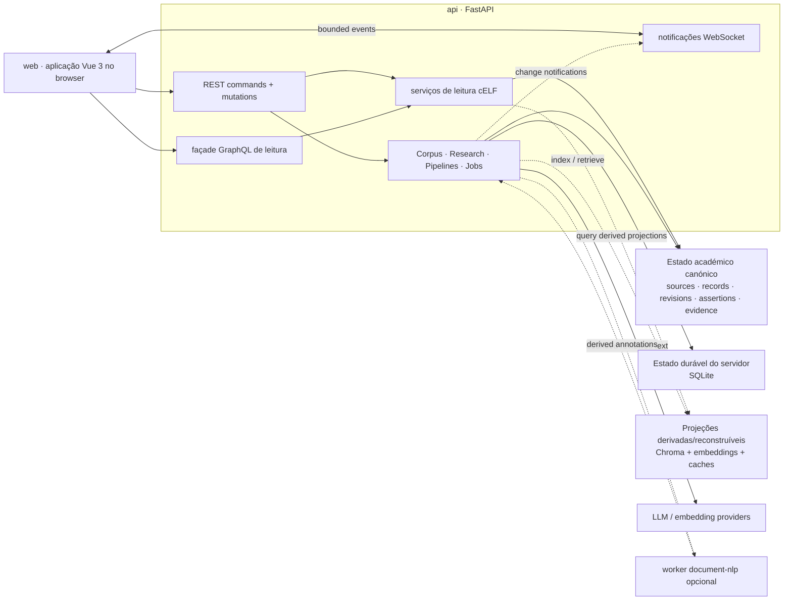

<!--
This file is part of DerridAI, a cELF-compliant research workspace
Copyright © 2026  Aaron John Schlosser, PhD

This program is free software: you can redistribute it and/or modify
it under the terms of the GNU Affero General Public License as
published by the Free Software Foundation, either version 3 of the
License, or (at your option) any later version.

This program is distributed in the hope that it will be useful,
but WITHOUT ANY WARRANTY; without even the implied warranty of
MERCHANTABILITY or FITNESS FOR A PARTICULAR PURPOSE.  See the
GNU Affero General Public License for more details.

You should have received a copy of the GNU Affero General Public License
along with this program.  If not, see <https://www.gnu.org/licenses/>.
-->

# DerridAI


[English](README.md) · [Français](README.fr.md) · [Español](README.es.md) · [Português](README.pt.md) · [Deutsch](README.de.md) · [Italiano](README.it.md) · [Magyar](README.hu.md) · [Русский](README.ru.md) · [हिन्दी](README.hi.md) · [বাংলা](README.bn.md) · [العربية](README.ar.md) · [简体中文](README.zh-CN.md)

DerridAI é um ambiente de investigação local-first que preserva a proveniência para construir, rever, pesquisar e consultar corpora académicos. Reúne ingestão de fontes, construção de corpus com intervenção humana, enriquecimento de metadados atento à evidência, índices vetoriais/de pesquisa derivados e geração aumentada por recuperação (RAG) fundamentada em evidência numa única aplicação Docker.

DerridAI é também a implementação de referência original do **cELF 1.0 — Capta-Enriched Lexical Format**, uma arquitetura de informação que preserva a proveniência para investigação documental assistida por IA. A implementação mantém separadamente inspecionáveis a identidade da fonte, a identidade e revisão do Record, as asserções de metadados, a evidência, os claims gerados e os support bindings, em vez de os achatar num único vector store opaco.

Versão atual: **0.81.0 — Fall River** ([notas de versão](docs/notes/0.81.0.md)). A versão da aplicação não foi aumentada desde Fall River; este README descreve a branch `master` atual, incluindo trabalho posterior a 0.81.0 que não faz parte da versão marcada com tag.

## Estado atual de `master`

A branch atual avançou substancialmente desde a tag 0.81.0, embora a versão da aplicação continue a ser 0.81.0. O resumo abaixo descreve o produto atual, não novas notas de versão.

- **Corpus Builder é agora um fluxo progressivo Configuração → Build → Revisão → Publicação.** Suporta enriquecimento concorrente limitado, escolhas explícitas de topologia do corpus e tamanho dos Records, revisão retomável e consciente das revisões, filas persistentes locais ao Record, sessões focadas na correção de bloqueios de publicação, grupos de metadados repetíveis, atribuição de oradores em áudio e revisão segura de texto durante preparação verificada.
- **O processamento de metadados e evidência faz menos trabalho de modelo e preserva semântica mais forte.** Routing determinístico/candidate-first, identidade semântica e equivalência de valores, evidence cascade v2 validada por suporte, reparação/classificação de structured completions e reconciliação incremental de Metadata Memory reduzem a latência sem permitir que relevância de retrieval ou output malformado se tornem evidência.
- **Pipeline Studio modela explicitamente computação executável.** Propósitos controlados pelo servidor, famílias de estratégias, efeitos académicos, ports tipados, wiring resolvido, traces por stage, métricas de âmbito/complexidade, parâmetros de retrieval ajustáveis e comparações não persistentes abrangem mais caminhos de Search, Research, reviewer evidence, recovery, segmentação e enrichment.
- **Works pode publicar sites de investigação portáteis.** As exportações estáticas combinam o DerridAI SDK com um runtime Vue dedicado para navegação, anotações, indexação semântica no browser, providers configurados pelo leitor e Research com citações ligadas à evidência, sem transformar a exportação em estado canónico do corpus.
- **Invalidação realtime e carregamento progressivo substituem mais polling e refreshes que esvaziam a página.** Works, Record, Search, Research, Response Library, Languages, Relationships, Accounts/Roles, Metadata Memory e outras superfícies retêm conteúdo útil, isolam falhas, oferecem retry local e descartam respostas obsoletas.
- **O frontend continua a retirar o legacy runtime.** Navegação controlada pelo router, diálogos/notificações Vue, módulos partilhados de domain/state, slices Pinia e helpers extraídos reduzem o acoplamento; o código de compatibilidade restante permanece isolado.
- **cELF e a infraestrutura de desenvolvimento foram reforçados.** A especificação é neutra em relação ao produto e orientada a profiles/provenance, com semântica generalizada de localizadores `EvidenceRef`; mapas de arquitetura documentam fronteiras críticas; seleção CI/pre-push, higiene do repositório e aplicação dos cabeçalhos de copyright foram fortalecidas.

## O que faz o DerridAI

- **Adquire e ingere fontes heterogéneas.** Carregue PDF, texto simples, RTF, DOCX, imagens e áudio; importe URLs e material do Project Gutenberg; ou use Corpus Capture para descobrir e adquirir obras através de adapters como Wikidata, Project Gutenberg e Wikisource. A ingestão aplica limites de segurança/recursos específicos do meio e preserva proveniência de extractor/tool/version.
- **Constrói corpora com fluxos sensíveis ao meio.** Corpus Builder separa registo da fonte, extração/transcrição, source-unit mapping, estrutura/segmentação, enriquecimento, construção de Records, revisão e publicação. Os controlos e as coordenadas de evidência adaptam-se ao meio em vez de aplicar conceitos de PDF/página a tudo.
- **Preserva proveniência cELF e autoridade de campos.** Records canónicos de `FieldAssertion` distinguem derivation, evaluation, authority, value state, confidence, evidence, actor/model, identidade estável do campo e revisão do Record. A confirmação humana não apaga a proveniência do modelo nem de processos determinísticos.
- **Revê Records com evidência em contexto.** Os revisores podem editar texto e metadados, inspecionar source spans e evidência de outros Records, comparar revisões, usar semantic maps e vistas de relações, aceitar ou rejeitar sugestões e publicar com decisões auditáveis.
- **Usa schemas de metadados configuráveis e precedentes revistos.** Os schemas definem campos estáveis, tipos, valores controlados, regras de evidência/revisão, hints POS/NER, scope do campo, orientação para o modelo e política de retrieval. Exemplos revistos tornam-se precedentes limitados e ligados à evidência para enriquecimento posterior sem substituir decisões canónicas do revisor.
- **Adiciona Document Intelligence opcional.** Uma camada de análise derivada e provider-neutral pode adicionar entidades, coreference, informação de quotation-speaker e relações de conteúdo semântico. São incluídos pequenos modelos spaCy de inglês e francês; outros language packs com digest verificado são geridos pelo administrador; um worker BookNLP isolado continua disponível como melhoria opcional para inglês. Estas anotações permanecem análise reconstruível, não evidência da fonte nem autoridade do corpus.
- **Pesquisa projeções derivadas sem as confundir com o corpus.** ChromaDB guarda projeções semânticas/de pesquisa e caches reconstruíveis, em modo embedded ou servidor HTTP. Dense, lexical, MMR, reciprocal-rank fusion, filtros, routing por idioma e reranking limitado por cross-encoder estão disponíveis quando apropriado.
- **Executa Research/RAG fundamentado em evidência.** Research suporta retrieval híbrido, reranking, selected-evidence mode, evidence budgets, dimensionamento opcional consciente do tamanho dos Records, geração streamed/cancelável, renderização determinística de citações, persistência claim/support, validação de claims, response/claim memory e LLM grading. Records com proveniência incompleta são excluídos da evidência em vez de serem tratados silenciosamente como suporte válido.
- **Publica sites de investigação portáteis.** Works pode exportar snapshots estáticos imutáveis com navegação Works/Record, filtros de metadados, anotações locais, pesquisa keyword/semantic/hybrid, vetores prontos para browser ou indexação local Transformers.js, providers de geração configurados pelo leitor e Research fundamentado em evidência. As citações inline determinísticas das respostas geradas ligam à evidência correspondente.
- **Inspeciona e configura pipelines de IA.** Pipeline Studio separa workflow purpose controlado pelo servidor, strategy family e scholarly effect; expõe inputs/outputs tipados por stage, wiring resolvido, definições e assignments versionados, traces, métricas scope/latency/complexity, parâmetros de tuning de retrieval, comparação não persistente e benchmarks de casos fixos. Gates de provenance/authority permanecem restrições estruturais.
- **Expõe transports de API distintos para tarefas distintas.** REST trata commands e mutations; uma façade GraphQL cELF-aware e read-only compõe leituras tipadas; um plano WebSocket autenticado envia notificações realtime. Mensagens realtime nunca são estado canónico e os clientes podem resincronizar por REST/GraphQL.
- **Suporta investigação multiutilizador controlada.** Roles Administrator e Researcher integrados, mais roles personalizados seguros para investigadores, são aplicados pela UI e API. Texto de fonte para investigadores é limitado na fronteira da API, jobs são owner-scoped e mutations de corpus/sistema exclusivas de administrador permanecem inacessíveis.
- **Mantém trabalho prolongado observável e as páginas utilizáveis durante mudanças de dados.** Corpus builds, LLM review, RAG, grading, imports, model/language-pack work e vector upserts aparecem como operations canceláveis com snapshots/histórico duráveis e progresso realtime. Notificações de mudança de recurso provocam refetch canónico sem tornar o WebSocket fonte de verdade.
- **Oferece uma interface acessível e multilingue.** Inglês e francês canadiano são locales de UI de primeira classe com paridade de keys verificada; a cobertura de README é mais ampla. WCAG 2.2 AA, teclado, foco visível, reflow, reduced motion, forced colors/high contrast e testes de strings longas/localização são critérios de qualidade. O Help Center é orientado à pesquisa, sensível ao role, bookmarkable e inclui atalhos por tarefa, guias por rota, FAQs e glossário técnico/em linguagem simples.
- **Faz backup do ambiente de investigação.** Backup/restore cobre workspaces, histórico de auditoria, provider profiles, assets de fontes, estado system/provenance e collections/embeddings Chroma.

Consulte o [Guia do Utilizador](docs/USER_GUIDE.md) para a referência completa de funcionalidades.

## Modelo de rastreabilidade cELF

O modelo de dados académicos do DerridAI segue a distinção cELF entre estado documental/académico autoritativo e projeções computacionais reconstruíveis. Com rastreabilidade completa, o caminho conceptual é:

```text
SourceDocument
  -> SourceSpan
  -> Record
  -> RecordRevision
  -> FieldAssertion
  -> Evidence Acquisition
  -> EvidenceRef
  -> EvidencePacket
  -> GenerationRun
  -> GeneratedClaim
  -> SupportBinding
```

Isto permite auditar uma resposta no sentido inverso desde um claim gerado até ao seu support, evidence, revisão do Record, SourceSpan e SourceDocument. Embeddings, retrieval rank, reranker scores, caches, UI state e outros valores específicos da operação permanecem estado derivado; não se tornam propriedades intrínsecas do Record da fonte.

Consulte [SPECIFICATION.md](SPECIFICATION.md) para a especificação normativa cELF 1.0.

## Arquitetura

As principais fronteiras de dependência e autoridade são:



Para desenvolvimento dentro de um subsistema, use os mapas locais mais específicos:

- [Backend application map](api/app/README.md)
- [Computational pipelines](api/app/pipelines/README.md)
- [Frontend workspace](web/README.md)
- [Frontend application map](web/src/README.md)
- [Frontend domain layer](web/src/domain/README.md)
- [Frontend components](web/src/components/README.md)
- [Frontend API clients](web/src/api/README.md)
- [Corpus Builder frontend feature](web/src/features/corpus-builder/README.md)
- [Corpus Builder components](web/src/components/corpus-builder/README.md)
- [Pipeline Studio components](web/src/components/pipelines/README.md)
- [Frontend test architecture](web/tests/README.md)

### Serviços runtime

- `web` — Vue 3, TypeScript, Pinia, Vue Router, Vite, PDF.js e nginx. É a aplicação no browser, faz proxy de `/api/` e consome REST, GraphQL e notificações realtime. Storybook é um profile de desenvolvimento opcional.
- `api` — Python 3.12, FastAPI, Strawberry GraphQL, cliente ChromaDB, PyMuPDF, sentence-transformers e spaCy. É a fronteira autoritativa para autenticação, operações source/corpus, leituras cELF, provenance, RAG, pipelines, jobs e estado do sistema.
- `document-nlp` — worker BookNLP isolado e opcional para Document Intelligence em inglês. Recebe texto revisto e limitado e não tem autoridade sobre o corpus.
- `chroma` — servidor Chroma HTTP opcional. O `PersistentClient` embedded continua a ser o default; ambos os modos guardam projeções de pesquisa/vetores derivadas.
- `ollama` — serviço Ollama local opcional. DerridAI pode usar Ollama já em execução no host ou qualquer endpoint OpenAI-compatible configurado.

A stack Compose default inicia `web` e `api`; os outros serviços são profiles opt-in ou providers externos.

### Autoridade e persistência

DerridAI não trata todos os stores como igualmente autoritativos:

- **Estado académico canónico** — assets/identidade das fontes, Records e revisions, field assertions, decisões de revisão, bindings exatos de evidence/support e estado de publicação.
- **Estado durável controlado pelo servidor** — autenticação e estado system/provenance/job/pipeline em SQLite sob `./data`.
- **Estado derivado/reconstruível** — índices Chroma, embeddings, projeções de metadata exemplars, retrieval scores, projeções semantic-content, output de Document Intelligence e caches.
- **Estado de workspace no browser** — preferências locais e estado não guardado, separado da autoridade do corpus.

### Divisão de transports

- **REST**: todos os commands e mutations, incluindo uploads, decisões de revisão, jobs, publicação, administração, backup e restore.
- **GraphQL**: façade de query tipada, cELF-aware e read-only em `POST /api/graphql`; sem mutation ou subscription root.
- **WebSocket**: plano autenticado de notificações realtime em `WS /api/ws/events`; nunca fonte de verdade.

Para ownership de módulos, fronteiras de persistência e data flow, consulte [Architecture](docs/ARCHITECTURE.md), [GraphQL](docs/GRAPHQL.md) e [Realtime](docs/REALTIME.md).

## Primeiros passos

Estes são os passos suportados a partir de um checkout limpo.

### 1. Pré-requisitos

Instale Git, Docker Engine/Desktop com o comando `docker compose` e um endpoint LLM. A configuração default espera Ollama no host.

Modelos default:

```text
gemma4:e2b
bge-m3:latest
```

### 2. Clonar e configurar

```bash
git clone https://github.com/ajschlosser/DerridAI.git
cd DerridAI
cp .env.example .env
```

PowerShell:

```powershell
Copy-Item .env.example .env
```

No Docker Desktop com WSL, defina `HOST_UID` e `HOST_GID` em `.env` com o resultado de `id -u` e `id -g`, para que os ficheiros SQLite/Chroma montados permaneçam propriedade do utilizador do host.

Não exporte globalmente variáveis de armazenamento de testes como `CHROMA_DATA_ROOT`, `AUTH_DB_PATH`, `SYSTEM_DB_PATH` ou `CHROMA_PATH`. O Compose interpola variáveis exportadas antes de passar os valores do ficheiro aos containers.

### 3. Disponibilizar os modelos configurados

Para Ollama já em execução no host:

```bash
ollama pull gemma4:e2b
ollama pull bge-m3:latest
```

O `.env.example` default usa:

```env
OLLAMA_BASE_URL=http://host.docker.internal:11434
OLLAMA_MODEL=gemma4:e2b
OLLAMA_EMBED_MODEL=bge-m3:latest
EMBEDDING_PROVIDER=ollama
```

Ou use o serviço Ollama opcional do Compose:

```bash
docker compose --profile ollama up -d ollama
docker compose exec ollama ollama pull gemma4:e2b
docker compose exec ollama ollama pull bge-m3:latest
```

Depois defina `OLLAMA_BASE_URL=http://ollama:11434` em `.env`.

### 4. Iniciar DerridAI

```bash
docker compose config --quiet
docker compose up -d --build
```

Endpoints default:

- Aplicação: <http://localhost:8181>
- API: <http://127.0.0.1:8000>
- Documentação OpenAPI: <http://127.0.0.1:8000/docs>

No primeiro arranque, crie a conta inicial de Administrator no browser. DerridAI não inclui credenciais default.

### 5. Verificar a instalação

```bash
docker compose ps
curl -fsS http://127.0.0.1:8000/api/live
```

A resposta de liveness deve conter `"ok": true`, a versão da aplicação e, quando disponível, o commit git incorporado.

Para um diagnóstico mais amplo:

```bash
./scripts/diagnose.sh
```

PowerShell:

```powershell
.\scripts\diagnose.ps1
```

### 6. Serviços opcionais

```bash
# Serviço Ollama local
docker compose --profile ollama up -d ollama

# Servidor Chroma HTTP (depois defina CHROMA_MODE=http)
docker compose --profile chroma up -d chroma

# Melhoria BookNLP para Document Intelligence em inglês
docker compose --profile document-nlp up -d document-nlp

# Superfície de desenvolvimento Storybook
docker compose --profile dev up storybook
```

Leia [Document Intelligence](docs/DOCUMENT_INTELLIGENCE.md) antes de ativar ou instalar language packs NLP.

### 7. Parar ou reconstruir

```bash
docker compose down

# depois de obter alterações
docker compose down
docker compose up -d --build
```

Se uma versão antiga deixou ficheiros pertencentes a root em `data/`, execute `./scripts/fix-data-permissions.sh` em hosts Unix-like suportados.

## Configuração para desenvolvimento

CI usa Python 3.12 e Node 22.

Ambiente backend/test:

```bash
python3.12 -m venv .venv
. .venv/bin/activate
python -m pip install --upgrade pip
pip install -r api/requirements-dev.txt
```

Ambiente frontend:

```bash
cd web
npm ci --no-audit --no-fund
npx playwright install chromium
cd ..
```

Quality gates locais rápidos:

```bash
ruff check api/app tests scripts/check_frontend_api_contract.py scripts/check_frontend_graphql_contract.py
mypy
python -m compileall -q api/app
pytest -q -n auto --dist=worksteal \
  --ignore=tests/test_frontend_api_contract.py \
  --ignore=tests/test_frontend_graphql_contract.py
pytest -q -m contract tests/test_frontend_api_contract.py tests/test_frontend_graphql_contract.py

cd web
npm run format:repo:check
npm run lint
npm run typecheck
npm run typecheck:tests
npm run test:unit
npm run build:ci
```

Use `npm run format:repo` a partir de `web/` para formatar todos os ficheiros de código, configuração e documentação suportados pelo Prettier. HTML gerado de snapshots DOM legacy é excluído intencionalmente.

Para browser coverage, Storybook, paridade com CI e regras de contribuição, consulte [CONTRIBUTING.md](CONTRIBUTING.md).

## Mapa do repositório

- `api/app/` — backend FastAPI: workflows source/corpus, serviços de leitura cELF, GraphQL, realtime, provenance, pipelines, RAG, providers, persistence e jobs.
- `web/src/` — aplicação Vue 3: views, components, Pinia stores, routing, API clients, realtime client, módulos de domain e a camada legacy de compatibilidade cada vez menor e isolada.
- `web/sdk/` — SDK TypeScript framework-neutral para carregamento de publicações, retrieval local, citações, anotações, provider injection e Research.
- `web/site/` — entrypoint Vue e compatibility adapter do runtime de sites de investigação portáteis.
- `booknlp-worker/` — worker BookNLP isolado e opcional para Document Intelligence.
- `tests/` — testes backend, regression, contract, release-consistency e architecture.
- `web/tests/frontend/` — testes Vitest de componentes/domain.
- `web/tests/e2e/` — cobertura Playwright da aplicação, Storybook, acessibilidade e characterization.
- `docs/` — contratos atuais de architecture/domain e notas históricas de versões.
- `data/` — estado runtime local; ignorado pelo Git exceto placeholders. Nunca faça commit do conteúdo.

## Documentação

Comece pelos documentos que descrevem o comportamento atual:

- [Guia do Utilizador](docs/USER_GUIDE.md) — referência de funcionalidades e workflows
- [Architecture](docs/ARCHITECTURE.md) — runtime boundaries, authority, persistence e data flow
- [Especificação cELF 1.0](SPECIFICATION.md) — modelo de informação normativo e requisitos de conformidade
- [Project context](docs/PROJECT_CONTEXT.md) — motivação académica e capacidades implementadas/pretendidas
- [GraphQL](docs/GRAPHQL.md) — façade de query cELF read-only
- [Realtime](docs/REALTIME.md) — protocolo de notificação WebSocket e ressincronização
- [Document Intelligence](docs/DOCUMENT_INTELLIGENCE.md) — análise linguística derivada e language packs
- [Source ingestion](docs/INGESTION_VALIDATION.md) — segurança, limites de recursos e fidelidade de extração
- [Metadata schemas](docs/METADATA_SCHEMAS.md) — contratos de campos configuráveis e orientação para modelos
- [Metadata memory](docs/METADATA_MEMORY.md) — precedentes revistos e fronteiras de authority
- [FieldAssertion migration](docs/FIELD_ASSERTION_MIGRATION.md) — modelo canónico de assertions e compatibilidade
- [Contributing](CONTRIBUTING.md) e [AGENTS.md](AGENTS.md) — regras de desenvolvimento e quality gates

O histórico de versões está em [CHANGELOG.md](CHANGELOG.md) e `docs/notes/<version>.md`. Notas específicas de uma versão são registos históricos, não documentação da arquitetura atual nem backlog.

## Licença

DerridAI é distribuído sob a [GNU Affero General Public License v3.0](LICENSE).

Copyright © 2026 Aaron John Schlosser, PhD. A aplicação também apresenta © 2026 The New England Transcendental Club of California.
