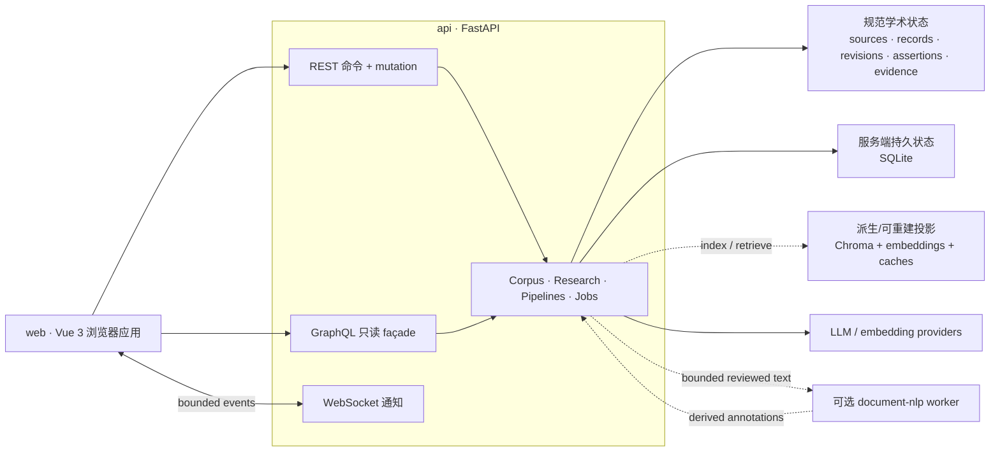

<!--
This file is part of DerridAI, a cELF-compliant research workspace
Copyright © 2026  Aaron John Schlosser, PhD

This program is free software: you can redistribute it and/or modify
it under the terms of the GNU Affero General Public License as
published by the Free Software Foundation, either version 3 of the
License, or (at your option) any later version.

This program is distributed in the hope that it will be useful,
but WITHOUT ANY WARRANTY; without even the implied warranty of
MERCHANTABILITY or FITNESS FOR A PARTICULAR PURPOSE.  See the
GNU Affero General Public License for more details.

You should have received a copy of the GNU Affero General Public License
along with this program.  If not, see <https://www.gnu.org/licenses/>.
-->

# DerridAI


[English](README.md) · [Français](README.fr.md) · [Español](README.es.md) · [Português](README.pt.md) · [Deutsch](README.de.md) · [Italiano](README.it.md) · [Magyar](README.hu.md) · [Русский](README.ru.md) · [हिन्दी](README.hi.md) · [বাংলা](README.bn.md) · [العربية](README.ar.md) · [简体中文](README.zh-CN.md)

DerridAI 是一个本地优先、保留来源链的研究环境，用于构建、审阅、搜索和查询学术语料库。它在一个 Docker 应用中整合了来源摄取、有人参与的语料库构建、证据感知的元数据富化、派生向量/搜索索引，以及以证据为基础的检索增强生成（RAG）。

DerridAI 也是 **cELF 1.0 — Capta-Enriched Lexical Format** 的原始参考实现。cELF 是面向 AI 辅助文献研究、保留来源与可追溯性的资讯架构。DerridAI 将来源身份、Record 身份与修订、元数据断言、证据、生成的主张和支持绑定分别保留并可独立审计，而不是把它们压平到不透明的向量库中。

当前版本：**0.82.0 — Gloucester**（[发布说明](docs/notes/0.82.0.md)）。本 README 描述 Gloucester 发布版。

## 当前 `master`

下面的摘要描述 Gloucester 发布版。

- **Corpus Builder 现在采用渐进式“设置 → 构建 → 审阅 → 发布”工作流。** 支持有界并发富化、明确的语料库拓扑和 Record 大小选择、可恢复且修订感知的审阅、持久的 Record 本地审阅队列、针对发布阻塞项的聚焦修复会话、可重复元数据组、音频说话人分配，以及在已验证准备过程中进行安全文本审阅。
- **元数据与证据处理减少了模型工作，同时保留更严格的语义。** 确定性/候选优先路由、语义身份与值等价、经过支持验证的 evidence cascade v2、结构化输出修复/重试分类，以及增量 Metadata Memory/示例协调，降低了延迟，同时不允许检索相关性或畸形输出自行成为证据。
- **Pipeline Studio 显式建模可执行计算。** 服务器拥有的用途、策略家族、学术效果、类型化端口、解析后的 wiring、阶段 trace、范围/复杂度指标、可调检索参数和非持久化比较，现已覆盖更多 Search、Research、审阅者证据、recovery、分段和富化路径。
- **Works 可以发布可移植研究网站。** 静态导出结合 DerridAI SDK 与专用 Vue runtime，提供浏览、注释、浏览器语义索引、读者配置的 provider，以及将引用绑定回证据的 Research，同时不会把导出物变成规范语料库状态。
- **实时失效与渐进加载正在替代更多轮询和整页空白刷新。** Works、Record、Search、Research、Response Library、Languages、Relationships、Accounts/Roles、Metadata Memory 等界面会保留可用内容、隔离失败、提供局部重试，并丢弃过期响应。
- **前端继续退出 legacy runtime。** 由 router 管理的导航、Vue 承载的对话框与通知、共享 domain/state 模块、Pinia slice，以及拆出的 provider/search/compare/workspace helper 都在降低耦合；剩余兼容代码保持隔离。
- **cELF 与开发基础设施进一步收紧。** 规范保持产品中立，并以 profile/provenance 为中心，采用更通用的 `EvidenceRef` 定位语义；关键代码边界新增架构图；CI/pre-push 选择、仓库卫生与版权头检查也得到加强。

## DerridAI 能做什么

- **获取和摄取异构来源。** 可上传 PDF、纯文本、RTF、DOCX、图像和音频；导入 URL 与 Project Gutenberg 内容；也可通过 Corpus Capture 使用 Wikidata、Project Gutenberg、Wikisource 等 provider adapter 发现和获取作品。摄取流程使用针对不同媒体的安全/资源限制，并保留 extractor、tool 与 version 的来源信息。
- **以媒体感知方式构建语料库。** Corpus Builder 将来源注册、提取/转录、source-unit 映射、结构/分段、富化、Record 构建、审阅与发布分开处理；控制项与证据坐标会随来源媒体变化，而不是把 PDF/页码概念强加到所有来源。
- **保留 cELF 来源链和字段权威。** 规范化的 `FieldAssertion` 会分别记录 derivation、evaluation、authority、value state、confidence、evidence、actor/model、稳定字段身份和 Record revision。人工确认不会抹去模型或确定性来源。
- **在证据上下文中审阅 Record。** 审阅者可以编辑文本与元数据、检查 source span 与其他 Record 的证据、比较修订、使用语义图与关系视图、接受或拒绝建议，并以可审计的决定发布内容。
- **使用可配置的元数据 schema 与已审阅先例。** Schema 定义稳定字段、类型、受控值、证据/审阅规则、POS/NER 提示、字段作用域、模型指引和检索策略。已审阅示例可作为有界、带证据链接的后续富化先例，但不会取代当前审阅者决定。
- **可选的 Document Intelligence。** Provider-neutral 的派生分析层可加入实体、共指、引语说话人信息与语义关系。镜像内置小型英语和法语 spaCy 模型；其他经过摘要校验的语言包由管理员管理；隔离的 BookNLP worker 仍可作为英语增强。此类标注是可重建分析，而非来源证据或语料库权威。
- **搜索派生投影而不混淆规范语料库。** ChromaDB 存放可重建的语义/搜索投影和缓存，可使用 embedded 或 HTTP-server 模式。适当场景下支持 dense、lexical、MMR、reciprocal-rank fusion、过滤、语言路由和有界 cross-encoder reranking。
- **运行以证据为基础的 Research/RAG。** Research 支持混合检索、reranking、selected-evidence 模式、证据预算、可选的 Record-size-aware 检索规模、流式/可取消生成、确定性引用渲染、claim/support 持久化、claim 验证、response/claim memory 与 LLM grading。来源链不完整的 Record 不会被悄悄当作有效证据。
- **发布可移植研究网站。** Works 可导出不可变静态快照，提供 Works/Record 浏览、元数据过滤、本地注释、关键词/语义/混合搜索、浏览器就绪向量或本地 Transformers.js 索引、由读者配置的生成 provider，以及以证据为基础的 Research。生成答案中的确定性内联引用会链接到相应证据。
- **检查和配置 AI pipeline。** Pipeline Studio 区分服务器拥有的 workflow purpose、strategy family 与 scholarly effect；显示类型化阶段输入/输出、解析后的 wiring、版本化定义与 assignment、trace、scope/latency/complexity 指标、检索调优参数、非持久化比较和固定案例 benchmark。来源链/权威 gate 仍是结构性约束。
- **为不同任务提供明确的 API transport。** REST 负责 command 与 mutation；只读的 cELF-aware GraphQL façade 负责组合类型化读取；经过认证的 WebSocket plane 发送实时操作通知。实时消息绝不是规范状态，客户端可通过 REST/GraphQL 重新同步。
- **支持受控的多用户研究。** 内置 Administrator 与 Researcher 角色，以及自定义 researcher-safe 角色，均由 UI 和 API 同时执行权限控制。Researcher 可见的来源文本在 API 边界进行限制，job 按 owner 隔离，管理员专属的语料库/系统 mutation 对 Researcher 不可用。
- **让长任务可观察，并让页面在数据变化时仍可使用。** Corpus build、LLM review、RAG、grading、import、model/language-pack 与 vector upsert 以可取消 operation 形式呈现，并保留持久快照/历史和实时进度。资源变化通知会触发规范读取刷新，而不会让 WebSocket 状态成为事实来源。
- **提供可访问、多语言界面。** English 与 Canadian French 是具有 key parity 检查的一等 UI locale；README 覆盖更多语言。WCAG 2.2 AA、键盘操作、可见焦点、reflow、reduced motion、forced colors/high contrast 和长字符串/本地化检查均是质量标准。Help Center 以搜索为入口，支持角色感知任务快捷入口、可书签状态、route 指引、FAQ 和技术/通俗术语表。
- **备份研究环境。** Backup/restore 覆盖 workspace、审计历史、provider profile、来源资产、system/provenance state，以及 Chroma collection/embedding。

完整功能参考见 [用户指南](docs/USER_GUIDE.md)。

## cELF 可追溯模型

DerridAI 的学术数据模型遵循 cELF 对“权威文献/学术状态”和“可重建计算投影”的区分。完整追溯路径为：

```text
SourceDocument
  -> SourceSpan
  -> Record
  -> RecordRevision
  -> FieldAssertion
  -> Evidence Acquisition
  -> EvidenceRef
  -> EvidencePacket
  -> GenerationRun
  -> GeneratedClaim
  -> SupportBinding
```

因此，一个生成的 claim 可以沿 support、evidence、Record revision、SourceSpan 一路反向审计到 SourceDocument。Embedding、retrieval rank、reranker score、cache、UI state 等操作级数据属于派生状态，不会变成来源 Record 的固有属性。

规范性 cELF 1.0 规范见 [SPECIFICATION.md](SPECIFICATION.md)。

## 架构

DerridAI 的顶层依赖与权威边界如下：



面向子系统开发时，可参考更具体的本地架构图：

- [Backend application map](api/app/README.md)
- [Computational pipelines](api/app/pipelines/README.md)
- [Frontend workspace](web/README.md)
- [Frontend application map](web/src/README.md)
- [Frontend domain layer](web/src/domain/README.md)
- [Frontend components](web/src/components/README.md)
- [Frontend API clients](web/src/api/README.md)
- [Corpus Builder frontend feature](web/src/features/corpus-builder/README.md)
- [Corpus Builder components](web/src/components/corpus-builder/README.md)
- [Pipeline Studio components](web/src/components/pipelines/README.md)
- [Frontend test architecture](web/tests/README.md)

### 运行时服务

- `web` — Vue 3、TypeScript、Pinia、Vue Router、Vite、PDF.js 与 nginx。它是浏览器应用，代理 `/api/`，并使用 REST、GraphQL 与实时通知。Storybook 是可选开发 profile。
- `api` — Python 3.12、FastAPI、Strawberry GraphQL、ChromaDB client、PyMuPDF、sentence-transformers 与 spaCy。它是 authentication、source/corpus operation、cELF read、provenance、RAG、pipeline、job 和 system state 的权威应用边界。
- `document-nlp` — 可选、隔离的 BookNLP worker，用于英语 Document Intelligence。只接收有界的已审阅文本，没有语料库权威。
- `chroma` — 可选 HTTP Chroma server。默认仍使用 embedded `PersistentClient`；两种模式都只保存派生搜索/向量投影。
- `ollama` — 可选本地 Ollama 服务。也可使用宿主机上已运行的 Ollama 或任意配置的 OpenAI-compatible endpoint。

默认 Compose stack 启动 `web` 和 `api`；其余服务均为 opt-in profile 或外部 provider。

### 权威与持久化

DerridAI 有意区分不同存储的权威级别：

- **规范学术状态** — 来源资产/身份、Records 与 revisions、FieldAssertions、review decision、精确 evidence/support binding 与 publication state。
- **服务器持久状态** — authentication，以及位于 `./data` 下 SQLite 中的 system/provenance/job/pipeline state。
- **派生/可重建状态** — Chroma index、embedding、metadata exemplar projection、retrieval score、semantic-content projection、Document Intelligence output 与 cache。
- **浏览器 workspace 状态** — 本地 working-set 偏好和未保存 workspace state，与语料库权威分离。

### Transport 分工

- **REST**：所有 command 与 mutation，包括 upload、review decision、job、publication、administration、backup 与 restore。
- **GraphQL**：`POST /api/graphql` 上只读、cELF-aware 的类型化查询 façade；没有 mutation 或 subscription root。
- **WebSocket**：`WS /api/ws/events` 上经过认证的实时通知 plane；从不作为事实来源。

详细模块归属、持久化边界与数据流见 [Architecture](docs/ARCHITECTURE.md)、[GraphQL](docs/GRAPHQL.md) 和 [Realtime](docs/REALTIME.md)。

## 开始使用

以下步骤适用于干净 checkout。

### 1. 前置条件

安装 Git、带 `docker compose` 命令的 Docker Engine/Desktop，以及一个 LLM endpoint。默认配置假定宿主机运行 Ollama。

默认模型：

```text
gemma4:e2b
bge-m3:latest
```

### 2. 克隆并配置

```bash
git clone https://github.com/ajschlosser/DerridAI.git
cd DerridAI
cp .env.example .env
```

PowerShell：

```powershell
Copy-Item .env.example .env
```

在 Docker Desktop + WSL 下，请在 `.env` 中把 `HOST_UID` 与 `HOST_GID` 设置为 `id -u` 和 `id -g` 的输出，使 bind-mounted SQLite/Chroma 文件保持由宿主用户拥有。

不要在 shell 中全局导出 `CHROMA_DATA_ROOT`、`AUTH_DB_PATH`、`SYSTEM_DB_PATH`、`CHROMA_PATH` 等 DerridAI 测试存储变量。Compose 会先展开环境变量，再把文件中的值传给容器。

### 3. 准备模型

如果 Ollama 已运行在宿主机：

```bash
ollama pull gemma4:e2b
ollama pull bge-m3:latest
```

默认 `.env.example` 使用：

```env
OLLAMA_BASE_URL=http://host.docker.internal:11434
OLLAMA_MODEL=gemma4:e2b
OLLAMA_EMBED_MODEL=bge-m3:latest
EMBEDDING_PROVIDER=ollama
```

也可以使用可选 Compose Ollama 服务：

```bash
docker compose --profile ollama up -d ollama
docker compose exec ollama ollama pull gemma4:e2b
docker compose exec ollama ollama pull bge-m3:latest
```

然后在 `.env` 中设置 `OLLAMA_BASE_URL=http://ollama:11434`。

### 4. 启动 DerridAI

```bash
docker compose config --quiet
docker compose up -d --build
```

默认端点：

- 应用：<http://localhost:8181>
- API：<http://127.0.0.1:8000>
- OpenAPI 文档：<http://127.0.0.1:8000/docs>

首次启动时，在浏览器中创建初始 Administrator 账户。DerridAI 不附带默认凭据。

### 5. 验证安装

```bash
docker compose ps
curl -fsS http://127.0.0.1:8000/api/live
```

Liveness response 应包含 `"ok": true`、应用版本，以及在可用时构建进镜像的 git commit。

更全面的诊断：

```bash
./scripts/diagnose.sh
```

PowerShell：

```powershell
.\scripts\diagnose.ps1
```

### 6. 可选服务

```bash
# 本地 Ollama 服务
docker compose --profile ollama up -d ollama

# Chroma HTTP server（随后设置 CHROMA_MODE=http）
docker compose --profile chroma up -d chroma

# 英语 BookNLP Document Intelligence 增强
docker compose --profile document-nlp up -d document-nlp

# Storybook 开发界面
docker compose --profile dev up storybook
```

启用或安装 NLP 语言包前，请先阅读 [Document Intelligence](docs/DOCUMENT_INTELLIGENCE.md)。

### 7. 停止或重建

```bash
docker compose down

# 拉取更新后
docker compose down
docker compose up -d --build
```

如果旧版本在 `data/` 下留下 root 所有的文件，请在受支持的类 Unix 主机上运行 `./scripts/fix-data-permissions.sh`。

## 开发者设置

CI 使用 Python 3.12 和 Node 22。

Backend/test 环境：

```bash
python3.12 -m venv .venv
. .venv/bin/activate
python -m pip install --upgrade pip
pip install -r api/requirements-dev.txt
```

Frontend 环境：

```bash
cd web
npm ci --no-audit --no-fund
npx playwright install chromium
cd ..
```

常用本地质量 gate：

```bash
ruff check api/app tests scripts/check_frontend_api_contract.py scripts/check_frontend_graphql_contract.py
mypy
python -m compileall -q api/app
pytest -q -n auto --dist=worksteal \
  --ignore=tests/test_frontend_api_contract.py \
  --ignore=tests/test_frontend_graphql_contract.py
pytest -q -m contract tests/test_frontend_api_contract.py tests/test_frontend_graphql_contract.py

cd web
npm run format:repo:check
npm run lint
npm run typecheck
npm run typecheck:tests
npm run test:unit
npm run build:ci
```

从 `web/` 运行 `npm run format:repo` 可格式化仓库中所有由 Prettier 支持的源码、配置与文档。生成的 legacy DOM snapshot HTML 会被有意排除。

浏览器覆盖、Storybook、CI parity 与贡献规则见 [CONTRIBUTING.md](CONTRIBUTING.md)。

## 仓库结构

- `api/app/` — FastAPI backend：source/corpus workflow、cELF read service、GraphQL、realtime、provenance、pipeline、RAG、provider、persistence 与 job。
- `web/src/` — Vue 3 应用：view、component、Pinia store、routing、API client、realtime client、domain module，以及逐步缩小且隔离的 legacy compatibility layer。
- `web/sdk/` — framework-neutral TypeScript SDK：publication loading、本地 retrieval、citation、annotation、provider injection 与 Research。
- `web/site/` — 可移植研究网站 runtime 的 Vue entrypoint 与 compatibility adapter。
- `booknlp-worker/` — 可选隔离 BookNLP Document Intelligence worker。
- `tests/` — backend、regression、contract、release-consistency 与 architecture test。
- `web/tests/frontend/` — Vitest component/domain test。
- `web/tests/e2e/` — Playwright application、Storybook、accessibility 与 characterization coverage。
- `docs/` — 当前 architecture/domain contract 与历史 release note。
- `data/` — 本地 runtime state；除 placeholder 外由 Git 忽略。不要提交其内容。

## 文档

建议从描述当前行为的文档开始：

- [用户指南](docs/USER_GUIDE.md) — 功能与工作流
- [Architecture](docs/ARCHITECTURE.md) — runtime boundary、authority、persistence 与 data flow
- [cELF 1.0 specification](SPECIFICATION.md) — 规范性信息模型与 conformance requirement
- [Project context](docs/PROJECT_CONTEXT.md) — 学术动机与已实现/计划能力
- [GraphQL](docs/GRAPHQL.md) — 只读 cELF query façade
- [Realtime](docs/REALTIME.md) — WebSocket 通知协议与重新同步
- [Document Intelligence](docs/DOCUMENT_INTELLIGENCE.md) — 派生语言分析与语言包
- [Source ingestion](docs/INGESTION_VALIDATION.md) — 安全、资源限制与提取保真
- [Metadata schemas](docs/METADATA_SCHEMAS.md) — 可配置字段 contract 与模型指引
- [Metadata memory](docs/METADATA_MEMORY.md) — 已审阅先例与 authority boundary
- [FieldAssertion migration](docs/FIELD_ASSERTION_MIGRATION.md) — 规范 assertion 模型与兼容工作
- [Contributing](CONTRIBUTING.md) 与 [AGENTS.md](AGENTS.md) — 开发规则与质量 gate

发布历史见 [CHANGELOG.md](CHANGELOG.md) 与 `docs/notes/<version>.md`。特定版本发布说明是历史记录，而不是当前架构或 backlog 文档。

## 许可证

DerridAI 采用 [GNU Affero General Public License v3.0](LICENSE)。

Copyright © 2026 Aaron John Schlosser, PhD. 应用中还显示 © 2026 The New England Transcendental Club of California。
