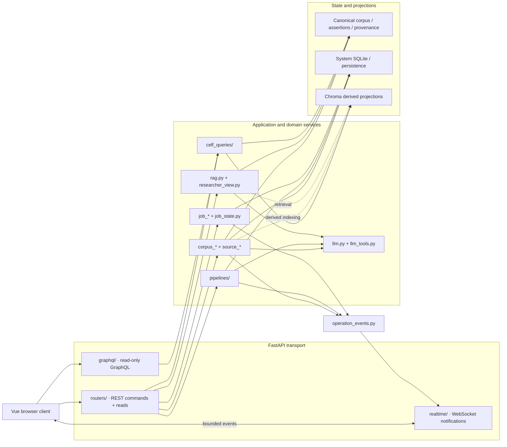

<!--
This file is part of DerridAI, a cELF-compliant research workspace
Copyright © 2026  Aaron John Schlosser, PhD

This program is free software: you can redistribute it and/or modify
it under the terms of the GNU Affero General Public License as
published by the Free Software Foundation, either version 3 of the
License, or (at your option) any later version.

This program is distributed in the hope that it will be useful,
but WITHOUT ANY WARRANTY; without even the implied warranty of
MERCHANTABILITY or FITNESS FOR A PARTICULAR PURPOSE.  See the
GNU Affero General Public License for more details.

You should have received a copy of the GNU Affero General Public License
along with this program.  If not, see <https://www.gnu.org/licenses/>.
-->

# Backend application architecture

`api/app/` is the implementation root for DerridAI's FastAPI process. It contains transport adapters, domain services, corpus orchestration, scholarly state handling, provider integration, pipeline execution, persistence, and derived search projections.

Use [`api/README.md`](../README.md) for backend setup and validation, [the project architecture](../../docs/ARCHITECTURE.md) for the cross-process view, and [`AGENTS.md`](../../AGENTS.md) for repository-wide invariants.

## Ownership and dependency direction

The backend deliberately separates transport from domain behavior and canonical state from derived projections.

- `main.py` is the minimal ASGI entrypoint.
- `application.py` constructs FastAPI, middleware, exception handling, and router composition.
- `routers/` owns REST transport. Route handlers should delegate rather than become the domain implementation.
- `celf_queries/` owns transport-independent scholarly reads shared by REST and GraphQL.
- `graphql/` is a read-only query façade. Mutations remain REST commands.
- `realtime/` is the WebSocket notification plane. It reports that state changed; it is never canonical state.
- `pipelines/` owns versioned computational pipeline definitions, validation, wiring, execution, tracing, benchmarking, and comparison.
- Focused `corpus_*`, `source_*`, metadata, research, job, and provider modules own domain behavior.
- `persistence.py`, `system_store.py`, and related stores hold server-owned durable state. Chroma modules hold derived/rebuildable projections rather than canonical scholarly authority.

## Major subpackages

| Path | Responsibility |
| --- | --- |
| `routers/` | REST HTTP adapters grouped by domain |
| `celf_queries/` | Shared cELF-aware read services |
| `graphql/` | Strawberry schema, permissions, loaders, and read resolvers |
| `realtime/` | Authenticated WebSocket protocol, broker, subscriptions, and resources |
| `pipelines/` | Typed/versioned computational pipeline system |
| `metadata_schema_profiles/` | Server-provided metadata profile definitions |
| `locales/` | Backend localization dictionaries |
| `site_assets/` | Static publication assets |

The large flat portion of this directory is intentional but should continue to move toward focused modules rather than a new monolith. New behavior belongs with the domain that owns its invariants.

## State and authority rules

Canonical scholarly state includes source identity, Records and revisions, FieldAssertions, review decisions, exact evidence bindings, and validated claims. Derived embeddings, Chroma collections, caches, semantic indexes, retrieval rankings, and realtime payloads must never silently become more authoritative than that state.

LLM output is untrusted until deterministic schema, evidence, provenance, and vocabulary validation accepts it. Citation resolution, IDs, source binding, exact-quote checks, and publication invariants belong to deterministic code.

## Adding backend behavior

Prefer this sequence:

1. Put domain logic in the focused owning module or subpackage.
2. Expose commands through the appropriate REST router.
3. Put reusable reads in `celf_queries/` when both REST and GraphQL need them.
4. Emit bounded change notifications through `operation_events.py`; do not import socket code into domain managers.
5. Persist canonical or operational state through the owning store.
6. Add topical tests under `tests/`.

Do not grow `main.py`, `jobs.py`, or `corpus_builder.py` merely because an existing compatibility import points there.
