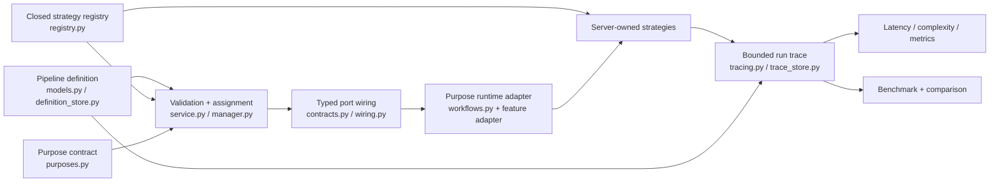

<!--
This file is part of DerridAI, a cELF-compliant research workspace
Copyright © 2026  Aaron John Schlosser, PhD

This program is free software: you can redistribute it and/or modify
it under the terms of the GNU Affero General Public License as
published by the Free Software Foundation, either version 3 of the
License, or (at your option) any later version.

This program is distributed in the hope that it will be useful,
but WITHOUT ANY WARRANTY; without even the implied warranty of
MERCHANTABILITY or FITNESS FOR A PARTICULAR PURPOSE.  See the
GNU Affero General Public License for more details.

You should have received a copy of the GNU Affero General Public License
along with this program.  If not, see <https://www.gnu.org/licenses/>.
-->

# Computational pipeline architecture

`api/app/pipelines/` implements DerridAI's declarative, versioned computational pipeline system. Pipelines choose and connect server-owned strategies for retrieval, reranking, evidence recovery, metadata work, research, and related computations without allowing a pipeline definition to weaken scholarly provenance or authority rules.

See [the backend map](../README.md), [the global architecture](../../../docs/ARCHITECTURE.md), and [the Pipeline migration handoff](../../../docs/PIPELINE_MIGRATION_HANDOFF.md).

## Core model

A saved pipeline definition is data over a closed strategy registry. Definitions are versioned and content-addressed; editing produces a new version rather than changing historical execution identity. Each executable purpose resolves a pipeline, validates its graph and ports, runs it through the purpose adapter, and records a bounded trace.

## File groups

| Area                           | Primary modules                                                                                                                     |
| ------------------------------ | ----------------------------------------------------------------------------------------------------------------------------------- |
| Contracts and definitions      | `models.py`, `contracts.py`, `defaults.py`, `definition_store.py`                                                                   |
| Registry and purpose semantics | `registry.py`, `purposes.py`, `workflows.py`                                                                                        |
| Validation and execution       | `service.py`, `manager.py`, `wiring.py`                                                                                             |
| Storage and search             | `store.py`, `storage.py`, `store_search.py`                                                                                         |
| Tracing and safety             | `tracing.py`, `trace_store.py`, `trace_safety.py`, `evidence_tracing.py`, `research_tracing.py`, `metadata_precedent_tracing.py`    |
| Operational analysis           | `latency.py`, `complexity.py`, `metrics.py`, `analysis.py`                                                                          |
| Evaluation                     | `benchmark.py`, `benchmark_store.py`, `comparison.py`                                                                               |
| Purpose adapters               | `research.py`, `evidence_recovery.py`, `metadata_prefill.py`, `metadata_precedents.py`, `corpus_*.py`, and related focused adapters |

## Non-negotiable boundaries

- A pipeline may tune computation; it may not override reviewer authority, source identity, evidence validation, access control, publication blockers, or other cELF invariants.
- User-authored pipeline definitions never execute arbitrary user code.
- The resolved `pipeline_id`, version, and content hash must remain attached to execution history.
- Required stage inputs are typed ports. Ambiguous, missing, or type-incompatible wiring is invalid.
- Fallbacks are explicit graph edges with traceable reasons rather than silent strategy swaps.
- Trace payloads are operational provenance, not scholarly truth. Keep source text, prompts, responses, secrets, and sealed reviewer values out of traces.
- Only purpose adapters that explicitly honour resolved bindings may claim free-form wiring support.

## Change checklist

When adding a strategy, define its typed inputs/outputs, complexity, concurrency semantics, validation, and registry entry together. When adding or migrating a purpose, keep domain policy outside the computational graph unless it is genuinely a tuning choice, add the purpose contract and adapter, and cover graph validation plus runtime semantics in `tests/test_pipeline_*.py`.

For readability, name stages, ports, bindings, and resolved strategies by their role rather than by position in a list. Wiring and fallback algorithms should expose their phases—validation, resolution, execution, trace projection—with short comments where ordering matters. Avoid a generic “pipeline data” dictionary when an existing contract type can state the port semantics.

Common traps are changing a registry entry without its version/definition implications, adding a graph port that the purpose adapter never consumes, logging source text or secrets into a trace, and treating comparison/benchmark output as persisted scholarly state. A compatibility pipeline that cannot satisfy current provenance/support gates may remain inspectable without being executable.

### Generic graph execution foundation

`graph_execution.py` runs server-owned handlers through `resolve_wiring` without imposing a strategy-name sequence. It supports named outputs, repeated strategy instances, deterministic fan-in ordering, selected fallback edges, and skipping empty required branches. Artifacts remain run-local; operational telemetry contains configuration hashes and counts. Handlers retain responsibility for payload validation and evidence semantics.

This module is a migration foundation. Existing feature adapters and production assignments remain in use. Scheduling defaults to serial; server-owned `ConcurrencyCapability` declarations and `max_workers` enable bounded parallel waves for thread-safe handlers with read-only inputs. Shared capacity keys bound calls across runs on one executor; adapters retain wider provider quotas. Fatal failures cancel queued work and join running handlers. Ports now declare required/produced computational traits, and the executor validates terminal type/trait guarantees. Historical metadata provider calls now execute through this engine with provider, ledger, ownership and concurrency parity coverage. Registered adaptive-domain handlers remain a prerequisite for adaptive routing. See `docs/METADATA_ENRICHMENT_ROUTING_PROGRESS.md` for the authoritative resume point.
