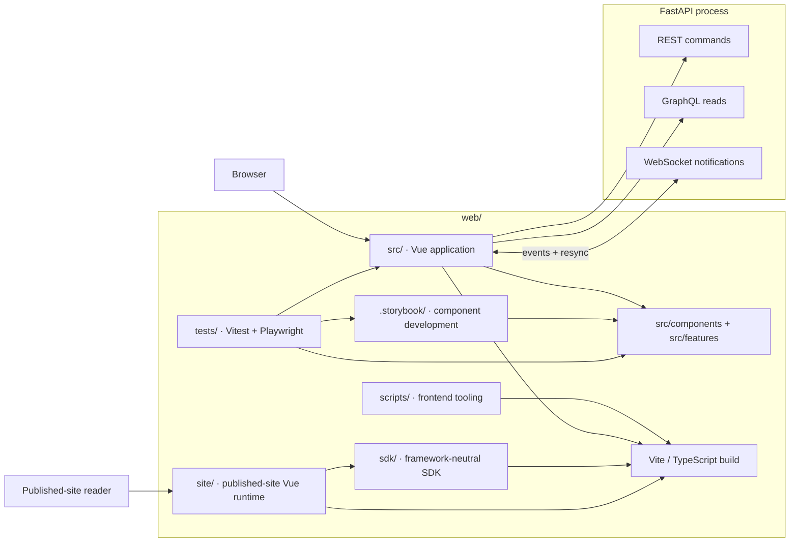

<!--
This file is part of DerridAI, a cELF-compliant research workspace
Copyright © 2026  Aaron John Schlosser, PhD

This program is free software: you can redistribute it and/or modify
it under the terms of the GNU Affero General Public License as
published by the Free Software Foundation, either version 3 of the
License, or (at your option) any later version.

This program is distributed in the hope that it will be useful,
but WITHOUT ANY WARRANTY; without even the implied warranty of
MERCHANTABILITY or FITNESS FOR A PARTICULAR PURPOSE.  See the
GNU Affero General Public License for more details.

You should have received a copy of the GNU Affero General Public License
along with this program.  If not, see <https://www.gnu.org/licenses/>.
-->

# Frontend workspace

`web/` contains DerridAI's Vue 3 application, TypeScript SDK, Storybook development surface, frontend tests, build configuration, and nginx-facing web assets.

Use the root [README](../README.md) for installation, [the architecture overview](../docs/ARCHITECTURE.md) for cross-process boundaries, and [`web/src/README.md`](src/README.md) for the application code map.

Use [the code readability guide](../docs/CODE_READABILITY.md) for naming, comments, and refactor conventions; frontend-specific placement rules live below and in the local `src/` READMEs.

## Runtime and developer surfaces



The browser/API transport split is intentional: REST owns commands and mutations, GraphQL is read-only, and WebSocket events only signal that state may need to be refreshed.

## Directory map

| Path              | Responsibility                                                            |
| ----------------- | ------------------------------------------------------------------------- |
| `src/`            | Production Vue application                                                |
| `tests/frontend/` | Vitest, Vue Test Utils, happy-dom, domain/component regression coverage   |
| `tests/e2e/`      | Playwright workflow, accessibility, and browser characterization coverage |
| `tests/fixtures/` | Frontend test fixtures                                                    |
| `sdk/`            | Published/consumable DerridAI client SDK                                  |
| `site/`           | Vue runtime for portable static research-site exports                     |
| `.storybook/`     | Storybook configuration                                                   |
| `scripts/`        | Frontend-specific checks and generation helpers                           |
| `public/`         | Static assets copied into the frontend build                              |

## Where to contribute

| Change | Start in |
| --- | --- |
| Route/page composition | `src/views/` |
| Reusable interaction/UI | `src/components/` (and Storybook) |
| Cohesive feature orchestration | `src/features/` |
| Vue lifecycle/async coordination | `src/composables/` |
| Pure transformations/presenters/codecs | `src/domain/` |
| REST/GraphQL transport | `src/api/` |
| Shared application state | `src/stores/` or `src/state/` |
| Frontend tests | `tests/frontend/` or `tests/e2e/` according to the boundary |

Do not add new product logic to `src/runtime/runtime.js` unless the change is specifically maintaining that compatibility boundary.

## Development rules

For a fresh frontend checkout:

```bash
npm ci --no-audit --no-fund
npx playwright install chromium
```

For app iteration, run `npm run dev` with the API listening on `127.0.0.1:8000`; Vite proxies `/api`. For isolated component work, use `npm run storybook`.

Components should use semantic design tokens, remain keyboard-operable, support light/dark and accessibility modes, and receive Storybook coverage when they define a reusable visual surface. English and French are first-class; do not introduce hard-coded user-facing strings.

For the production application, prefer the dependency direction documented in [`src/README.md`](src/README.md). Avoid moving business logic into route views or transport clients merely to make a component simpler.

## Common validation

From this directory:

```bash
npm run format:repo:check
npm run typecheck
npm run typecheck:tests
npm run test:unit
npm run build
npm run build-storybook
```

Browser suites use Playwright and are documented in [`tests/e2e/README.md`](tests/e2e/README.md).

## Contribution traps

- `src/runtime/` is remaining compatibility orchestration, not the default home for new application behavior. Prefer an owning view/feature/composable/domain/store/service boundary.
- `src/api/graphql/generated.ts` is generated from GraphQL operations/schema. Run `npm run codegen`; do not hand-edit it.
- `api/app/site_assets/derridai-sdk.js` and `derridai-site.js` are generated by `build:sdk` and `build:site`. Edit `sdk/` or `site/` instead.
- Storybook tests exercise reusable visual states; production application E2E exercises composed routes. Add coverage at the narrowest layer that can demonstrate the behavior.
- User-facing copy belongs in i18n resources, with English/Canadian-French parity. Components must remain keyboard-operable and WCAG 2.2 AA-safe under reflow, reduced motion, forced colors, and long localized strings.
- Framework-light domain helpers should use descriptive names and focused types. Preserve a broad compatibility type only where callers actually require it; do not spread `Record<string, any>` by convenience.
