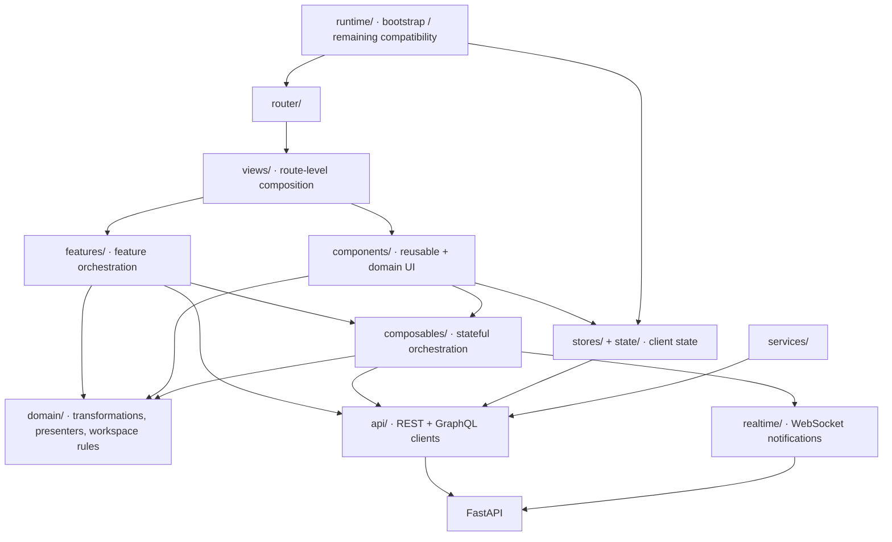

<!--
This file is part of DerridAI, a cELF-compliant research workspace
Copyright © 2026  Aaron John Schlosser, PhD

This program is free software: you can redistribute it and/or modify
it under the terms of the GNU Affero General Public License as
published by the Free Software Foundation, either version 3 of the
License, or (at your option) any later version.

This program is distributed in the hope that it will be useful,
but WITHOUT ANY WARRANTY; without even the implied warranty of
MERCHANTABILITY or FITNESS FOR A PARTICULAR PURPOSE.  See the
GNU Affero General Public License for more details.

You should have received a copy of the GNU Affero General Public License
along with this program.  If not, see <https://www.gnu.org/licenses/>.
-->

# Frontend application architecture

`web/src/` is the production Vue application. It separates route composition, feature orchestration, reusable UI, framework-light domain logic, API transport, realtime notifications, and persistent client state.

See [the frontend workspace](../README.md) and [the project architecture](../../docs/ARCHITECTURE.md).

## Dependency map

This is an architectural direction, not a claim that every legacy import is already perfect. `runtime/` and compatibility helpers still exist while older orchestration is retired.

## Directory map

| Path | Responsibility |
| --- | --- |
| `views/` | Route-level pages and workspace composition |
| `features/` | Cohesive feature packages with domain/composable/API pieces |
| `components/` | Reusable primitives, shell components, and domain UI |
| `composables/` | Vue composables coordinating state, async work, and domain helpers |
| `domain/` | Mostly framework-light domain transformations, presenters, codecs, and workspace rules |
| `api/` | Typed REST/GraphQL transport clients |
| `realtime/` | WebSocket connection and refresh bridge |
| `stores/`, `state/` | Pinia and shared client state |
| `router/` | Route definitions and route loading |
| `runtime/` | Application bootstrap and remaining compatibility orchestration |
| `services/` | Focused application services |
| `i18n/` | Frontend locale resources |
| `styles/` | Design tokens and shared styles |
| `types/` | Shared TypeScript types |
| `fragments/` | Shared GraphQL/document fragments |

## Placement guidance

Put route composition in `views/`, not reusable components. Put reusable visual behavior in `components/`; if it belongs to a cohesive feature and needs orchestration, use `features/`. Put stateful Vue coordination in a composable and keep transform/presentation logic in `domain/` when it can remain framework-light. Network effects belong in `api/` or `realtime/`, not in presentation helpers.

Do not use frontend state as scholarly authority. Canonical corpus, review, assertion, evidence, and provenance state is owned by the backend; optimistic UI must reconcile with server results.

## Critical local maps

- [Domain helpers](domain/README.md)
- [Components](components/README.md)
- [API clients](api/README.md)
- [Corpus Builder feature](features/corpus-builder/README.md)
