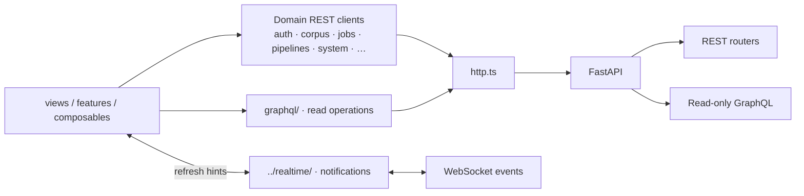

<!--
This file is part of DerridAI, a cELF-compliant research workspace
Copyright © 2026  Aaron John Schlosser, PhD

This program is free software: you can redistribute it and/or modify
it under the terms of the GNU Affero General Public License as
published by the Free Software Foundation, either version 3 of the
License, or (at your option) any later version.

This program is distributed in the hope that it will be useful,
but WITHOUT ANY WARRANTY; without even the implied warranty of
MERCHANTABILITY or FITNESS FOR A PARTICULAR PURPOSE.  See the
GNU Affero General Public License for more details.

You should have received a copy of the GNU Affero General Public License
along with this program.  If not, see <https://www.gnu.org/licenses/>.
-->

# Frontend API clients

`web/src/api/` is the production application's HTTP query/command boundary. It centralizes typed transport behavior so views and components do not assemble ad hoc endpoints or duplicate authentication/error handling.

Realtime notifications are separate in `../realtime/`; they are not a second API state store.

## Transport split

REST is the command/mutation authority. GraphQL is a read-only cELF-aware façade. WebSocket messages indicate that data changed; clients resynchronize authoritative state through REST or GraphQL.

## Layout

| Path                                                          | Responsibility                                                                                   |
| ------------------------------------------------------------- | ------------------------------------------------------------------------------------------------ |
| `http.ts`                                                     | Shared HTTP mechanics and common request behavior                                                |
| `corpus/`                                                     | Focused Corpus Builder API clients                                                               |
| `graphql/`                                                    | GraphQL client, operations, generated/schema artifacts                                           |
| `auth.ts`, `jobs.ts`, `pipelines.ts`, `sites.ts`, `system.ts` | Domain REST clients                                                                              |
| `chroma.ts`                                                   | Chroma/vector administration client                                                              |
| `metadataSchemas.ts`, `metadataMemory.ts`                     | Metadata schema and precedent-memory APIs                                                        |
| `claims.ts`, `documentNlp.ts`                                 | Claim and document-intelligence APIs                                                             |
| `pdfCorpus.ts`                                                | Historical/compatibility Corpus Builder client surface; source-media support is broader than PDF |

## Rules

Send only the fields required by an operation. Keep request/response schemas narrow and explicit, and do not turn one generic record payload into the transport for unrelated commands.

Do not infer authority from a transport response shape. Review status, FieldAssertion authority, source identity, and evidence provenance are backend domain contracts.

When a read is shared between REST and GraphQL, backend ownership belongs in `api/app/celf_queries/`; do not recreate competing read semantics in the frontend.

## Contributing safely

- For a REST request change, keep the method/path/payload typed here and run `tests/test_frontend_api_contract.py` from the repository root.
- For a GraphQL operation change, edit the operation/schema source, run `npm run codegen`, and run `tests/test_frontend_graphql_contract.py`. Never hand-edit `graphql/generated.ts`.
- Treat `http.ts` as shared infrastructure: changes to authentication, error parsing, cancellation, or retry behavior can affect every workspace and deserve focused regression coverage.
- Keep operation-specific response shaping close to the owning client or feature. Do not make `http.ts` understand corpus, Research, Pipeline Studio, or metadata semantics.
- Use names that expose the transport/domain role (`reviewRecord`, `pipelineDefinition`, `requestSignal`) rather than generic `data` or `result` when several payloads coexist.
- WebSocket events belong in `../realtime/`; receiving an event must not bypass the canonical REST/GraphQL read that reconciles state.
