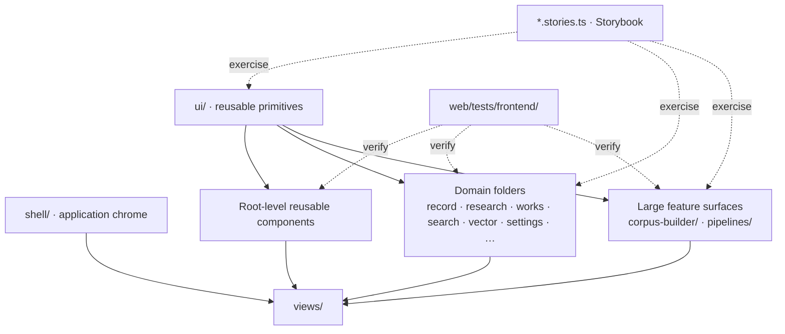

<!--
This file is part of DerridAI, a cELF-compliant research workspace
Copyright © 2026  Aaron John Schlosser, PhD

This program is free software: you can redistribute it and/or modify
it under the terms of the GNU Affero General Public License as
published by the Free Software Foundation, either version 3 of the
License, or (at your option) any later version.

This program is distributed in the hope that it will be useful,
but WITHOUT ANY WARRANTY; without even the implied warranty of
MERCHANTABILITY or FITNESS FOR A PARTICULAR PURPOSE.  See the
GNU Affero General Public License for more details.

You should have received a copy of the GNU Affero General Public License
along with this program.  If not, see <https://www.gnu.org/licenses/>.
-->

# Frontend component architecture

`web/src/components/` contains DerridAI's Vue presentation layer: design-system primitives, application shell, reusable dialogs and controls, and domain-specific workspaces.

Components render and coordinate interaction; canonical scholarly authority remains on the backend. Complex state rules should be extracted into domain modules or composables rather than duplicated across views.

## Component layers

## Folder ownership

| Folder                                                           | Primary concern                                                                      |
| ---------------------------------------------------------------- | ------------------------------------------------------------------------------------ |
| `ui/`                                                            | Shared accessible primitives and common interaction patterns                         |
| `shell/`                                                         | Sidebar, topbar, route chrome, global navigation surfaces                            |
| `corpus-builder/`                                                | Setup, build, concurrent review, semantic inspection, and publish UI                 |
| `pipelines/`                                                     | Pipeline Studio definitions, graph editor, execution traces, benchmarks, comparisons |
| `record/`, `records/`                                            | Single-record inspection/editing versus collection/workspace record surfaces         |
| `research/`                                                      | Research composer, evidence, claims, traceability, response presentation             |
| `metadata-schemas/`, `metadata-memory/`                          | Schema authoring and reviewed precedent inspection                                   |
| `works/`                                                         | Work aggregation and work-level editing                                              |
| `search/`                                                        | Search-specific controls and result presentation                                     |
| `semantic/`, `relations/`                                        | Semantic graph/map and relation presentation                                         |
| `settings/`, `providers/`, `vector/`, `system-data/`, `capture/` | Administrative and infrastructure-facing product surfaces                            |

Root-level components are shared pieces that predate or span those domains. When ownership becomes clear, prefer a domain folder instead of adding another unrelated root-level component.

## Component rules

- Reusable visual primitives belong in `ui/`; domain-specific behavior does not.
- Route orchestration belongs in `views/`; reusable feature composition belongs here or in `features/`.
- Move non-trivial state transitions and formatting into `domain/` when they can be framework-light.
- Use composables for Vue reactivity, async coordination, and reusable lifecycle behavior.
- Add or update Storybook stories for reusable visual surfaces.
- Use semantic design tokens and preserve WCAG 2.2 AA behavior, keyboard operation, localization, long-string resilience, and light/dark/high-contrast support.

See the focused maps for [Corpus Builder](corpus-builder/README.md) and [Pipeline Studio](pipelines/README.md).
