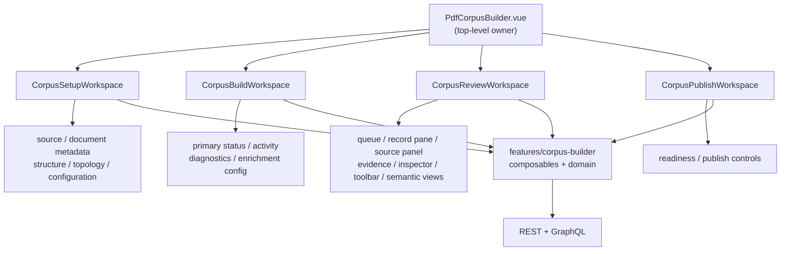

<!--
This file is part of DerridAI, a cELF-compliant research workspace
Copyright © 2026  Aaron John Schlosser, PhD

This program is free software: you can redistribute it and/or modify
it under the terms of the GNU Affero General Public License as
published by the Free Software Foundation, either version 3 of the
License, or (at your option) any later version.

This program is distributed in the hope that it will be useful,
but WITHOUT ANY WARRANTY; without even the implied warranty of
MERCHANTABILITY or FITNESS FOR A PARTICULAR PURPOSE.  See the
GNU Affero General Public License for more details.

You should have received a copy of the GNU Affero General Public License
along with this program.  If not, see <https://www.gnu.org/licenses/>.
-->

# Corpus Builder components

`web/src/components/corpus-builder/` contains the visual workspaces and review surfaces for Corpus Builder. It is the UI counterpart to [the feature layer](../../features/corpus-builder/README.md).

The folder is organized around the current researcher workflow rather than around historical implementation phases.

## Workspace composition

Build and Review are intentionally concurrent once topology is available. Components should therefore render partial/progressive state explicitly rather than treating enrichment completion as a prerequisite for all review.

## Component families

- **Setup:** `CorpusSetupWorkspace`, `CorpusSetupSection`, document metadata, library search/import, missing-field guidance, topology policy.
- **Build monitoring:** primary status, activity, diagnostics, run diagnostics, enrichment and advanced configuration.
- **Review:** queue, record pane, decision dock, source/evidence panels, inspector, shortcuts, toolbar, run status, context reader.
- **Semantic inspection:** record semantic map, semantic workspace, graph panels, aliases, entity index, annotated text.
- **Publish:** `CorpusPublishWorkspace` and readiness/publish-facing composition.
- **Reusable feature pieces:** workspace header, focus header, movable record modal, evidence browser and other shared Corpus Builder interaction surfaces.

Storybook stories sit beside reusable components. New visual behavior should normally include a representative story and focused Vitest coverage.

## Boundaries

Keep API calls and lifecycle orchestration in the feature/composable layer rather than duplicating them across components. Keep deterministic presentation/state logic in feature or shared domain modules. Components may coordinate interaction, but they should not decide scholarly authority, fabricate confidence/evidence, or bypass backend review invariants.

Use medium-neutral names and controls unless a component is genuinely specific to one source kind.
