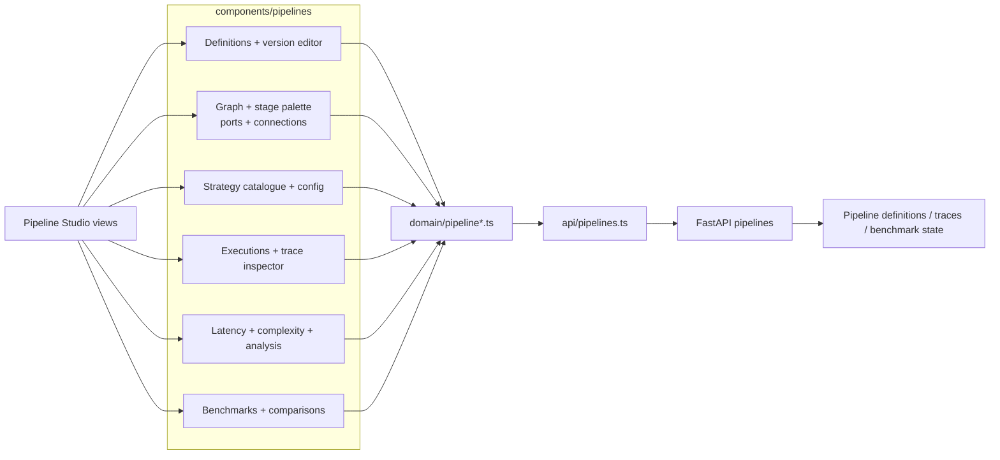

<!--
This file is part of DerridAI, a cELF-compliant research workspace
Copyright © 2026  Aaron John Schlosser, PhD

This program is free software: you can redistribute it and/or modify
it under the terms of the GNU Affero General Public License as
published by the Free Software Foundation, either version 3 of the
License, or (at your option) any later version.

This program is distributed in the hope that it will be useful,
but WITHOUT ANY WARRANTY; without even the implied warranty of
MERCHANTABILITY or FITNESS FOR A PARTICULAR PURPOSE.  See the
GNU Affero General Public License for more details.

You should have received a copy of the GNU Affero General Public License
along with this program.  If not, see <https://www.gnu.org/licenses/>.
-->

# Pipeline Studio components

`web/src/components/pipelines/` implements Pipeline Studio's visual surfaces for inspecting, editing, executing, benchmarking, and comparing versioned computational pipelines.

The backend contract lives in [`api/app/pipelines/`](../../../../api/app/pipelines/README.md). The frontend must present that contract without implying that editable computation can override scholarly provenance or review authority.

## Studio architecture

## Component groups

| Area | Representative components |
| --- | --- |
| Definitions/versioning | `PipelineDefinitionsWorkspace`, `PipelineDefinitionEditor`, `PipelineDefinitionDetail`, `PipelineVersionEditorPanel` |
| Graph editing | `PipelineGraphDiagram`, `PipelineStageEditor`, `PipelineStagePalette`, `PipelineStagePorts`, `PipelineStageConnections` |
| Strategies | `PipelineStrategiesWorkspace`, `PipelineStrategyTable`, `PipelineStrategyInspector`, `PipelineStrategyConfigFields` |
| Execution history | `PipelineExecutionsWorkspace`, `PipelineExecutionList`, `PipelineExecutionInspector`, `PipelineRunTracePanel` |
| Operational analysis | `PipelineAnalysisPanel`, `PipelineLatencyView`, `PipelineComplexityView`, `PipelineOperationsWorkspace` |
| Evaluation | `PipelineBenchmarkWorkspace`, `PipelineBenchmarkCaseList`, `PipelineComparisonWorkspace`, comparison-result components |

## Presentation rules

Pipeline latency and complexity are operational measurements/estimates and must retain their basis and sample size. Missing data is unknown, not zero.

A graph editor may expose only capabilities the backend can validate and execute. Do not present arbitrary bindings as executable when the relevant purpose adapter does not honour them. Invalid or inspect-only wiring should remain visibly distinct from executable versions.

Trace views must treat traces as bounded operational provenance. They must not imply that a trace score establishes scholarly truth or reviewer confirmation.
