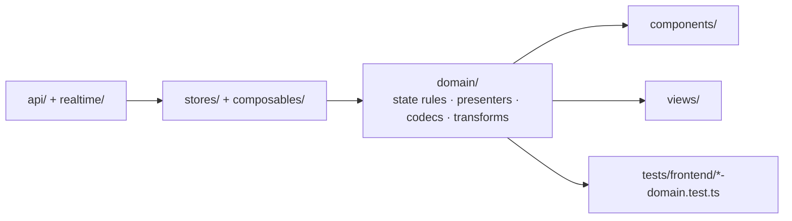

<!--
This file is part of DerridAI, a cELF-compliant research workspace
Copyright © 2026  Aaron John Schlosser, PhD

This program is free software: you can redistribute it and/or modify
it under the terms of the GNU Affero General Public License as
published by the Free Software Foundation, either version 3 of the
License, or (at your option) any later version.

This program is distributed in the hope that it will be useful,
but WITHOUT ANY WARRANTY; without even the implied warranty of
MERCHANTABILITY or FITNESS FOR A PARTICULAR PURPOSE.  See the
GNU Affero General Public License for more details.

You should have received a copy of the GNU Affero General Public License
along with this program.  If not, see <https://www.gnu.org/licenses/>.
-->

# Frontend domain layer

`web/src/domain/` contains the frontend's framework-light domain helpers: workspace state models, transformations, formatting, presenters, validation helpers, URL/state codecs, and rules that are easier to test outside Vue components.

The directory is intentionally broad, but it should not become a dumping ground. Group behavior by the product concept it represents and keep network/DOM effects at outer layers whenever practical.

## Architectural role

Some compatibility modules still bridge older runtime behavior, so this diagram expresses the target dependency direction rather than pretending every existing file is side-effect free.

## Major topic families

The flat namespace currently groups related modules by filename prefix:

- `record*`, `records*`, `pastedRecord.ts` — record editing, formatting, querying, workspace state, subsets, mutation queues, and table helpers.
- `research*`, `evidenceSelection.ts`, `citations.ts` — Research request/response state and evidence presentation.
- `search*` — query, facets, filter schema, and Search workspace state.
- `pipeline*` — Pipeline Studio graph, bindings, presentation, workflows, and analysis presentation.
- `metadata*`, `fieldAssertions.ts`, `documentFields.ts`, `nlpTags.ts` — metadata field, evidence, assertion, precedent, and schema-facing behavior.
- `corpus*`, `reviewPresentation.ts`, `touchupFields.ts`, `documentLayoutRegions.ts` — Corpus Builder and review-facing helpers that are shared beyond its feature package.
- `provider*`, `sharedProviderProfiles.ts` — provider model/profile behavior.
- `navigation*`, `urlState*`, `workspace*`, `shared*` — cross-workspace state and navigation contracts.
- `semantic*` and `relations/` — semantic-map/graph presentation and relation primitives.

## What belongs here

Good candidates are deterministic transformations, selectors, serializers/codecs, presentation models, validation helpers, and state transition rules that do not require a Vue component to exist.

Prefer `composables/` for Vue lifecycle/reactivity orchestration, `api/` for network calls, `components/` for rendering and direct interaction, and `stores/` for application-wide reactive state.

When adding a large new domain, consider a focused subdirectory rather than extending the flat namespace indefinitely. Preserve existing public imports when refactoring and add focused Vitest coverage.
