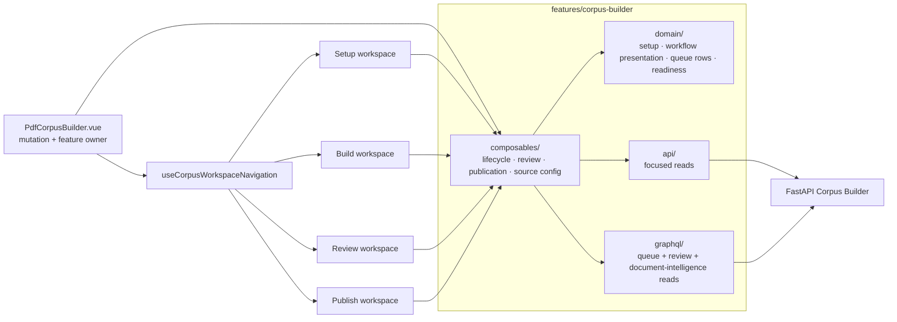

<!--
This file is part of DerridAI, a cELF-compliant research workspace
Copyright © 2026  Aaron John Schlosser, PhD

This program is free software: you can redistribute it and/or modify
it under the terms of the GNU Affero General Public License as
published by the Free Software Foundation, either version 3 of the
License, or (at your option) any later version.

This program is distributed in the hope that it will be useful,
but WITHOUT ANY WARRANTY; without even the implied warranty of
MERCHANTABILITY or FITNESS FOR A PARTICULAR PURPOSE.  See the
GNU Affero General Public License for more details.

You should have received a copy of the GNU Affero General Public License
along with this program.  If not, see <https://www.gnu.org/licenses/>.
-->

# Corpus Builder frontend feature

`web/src/features/corpus-builder/` contains the non-visual feature layer for Corpus Builder: focused reads, GraphQL operations, Vue composables, workflow state, and presentation/domain helpers.

The visual workspaces live in [`components/corpus-builder/`](../../components/corpus-builder/README.md). `PdfCorpusBuilder.vue` remains the top-level composition/orchestration component while the product itself is source-media aware and is not limited to PDFs.

## Feature architecture

## Workspace model

The researcher-facing flow is **Setup → Build & review → Publish**. Internally the route-backed workspace state remains `setup | build | review | publish`, so deep links and state transitions stay explicit. Build and Review can be active concurrently once Record topology exists; the UI must not imply that all enrichment has to finish before review begins.

## Folder map

| Folder         | Responsibility                                                                                                                                     |
| -------------- | -------------------------------------------------------------------------------------------------------------------------------------------------- |
| `composables/` | Build lifecycle, setup state, provider/source configuration, review decisions/navigation/records, text/metadata/boundary review, publication       |
| `domain/`      | Workflow presentation, setup-state derivation, queue rows, review commands, metadata decisions, semantic map, record sizing, publication readiness |
| `api/`         | Focused REST-backed reads for review/document intelligence                                                                                         |
| `graphql/`     | Corpus queue, review-record, facet, text, and document-intelligence read documents                                                                 |
| `*.css`        | Feature-level Corpus Builder shell/review styling                                                                                                  |

## Invariants

Frontend workflow state is a projection, not corpus authority. Reviewer-confirmed structure and accepted review decisions come from the backend. Optimistic interactions must reconcile with persisted revisions and must not overwrite intervening human-owned state.

Source controls must be media-aware. Do not expose PDF/page concepts for audio or other media where they are meaningless. Keep source coordinates appropriate to the medium and preserve uncertainty rather than manufacturing review readiness.

## Where a Corpus Builder change belongs

- **Workflow/lifecycle coordination:** an owning composable. Keep cancellation, optimistic reconciliation, refresh sequencing, and stale-response protection close to the lifecycle that owns them.
- **Deterministic presentation or state transitions:** `domain/`. Prefer pure helpers that can be exercised without mounting the builder.
- **Focused server reads:** `api/` or `graphql/`. GraphQL remains read-only; mutations stay in REST through the existing owner.
- **Visual composition:** `components/corpus-builder/`. Components should receive state/actions rather than reimplement lifecycle rules.
- **Top-level mutation compatibility:** `PdfCorpusBuilder.vue` only when an existing contract still requires that owner. New behavior should normally be extracted behind a focused typed interface.

## Gotchas

Build and Review intentionally overlap after topology exists, so “build complete” is not a safe proxy for “review may begin.” Review queues are revision-sensitive; an optimistic decision must reconcile with the persisted Record revision rather than overwrite intervening human work. Progressive reads may be partial or stale while a newer request is in flight, so preserve last-known-good UI where the feature already does so. Source terminology must remain media-aware, and publication readiness comes from backend validation rather than a frontend checklist invented locally.
