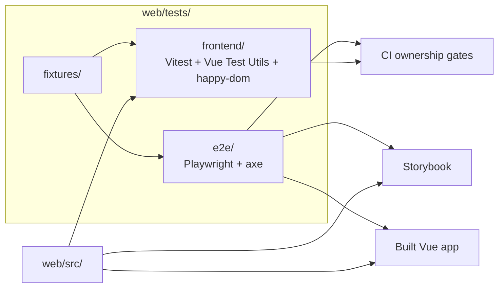

<!--
This file is part of DerridAI, a cELF-compliant research workspace
Copyright © 2026  Aaron John Schlosser, PhD

This program is free software: you can redistribute it and/or modify
it under the terms of the GNU Affero General Public License as
published by the Free Software Foundation, either version 3 of the
License, or (at your option) any later version.

This program is distributed in the hope that it will be useful,
but WITHOUT ANY WARRANTY; without even the implied warranty of
MERCHANTABILITY or FITNESS FOR A PARTICULAR PURPOSE.  See the
GNU Affero General Public License for more details.

You should have received a copy of the GNU Affero General Public License
along with this program.  If not, see <https://www.gnu.org/licenses/>.
-->

# Frontend test architecture

`web/tests/` owns frontend automated coverage. Tests are split by execution boundary so fast deterministic checks do not have to impersonate browser workflows and browser characterization does not become ordinary unit coverage.

See [the repository test guide](../../tests/README.md) for the full project taxonomy.

## Test surfaces



## Ownership

- [`frontend/`](frontend/README.md) covers domain helpers, components, stores, API/realtime clients, and characterization-sensitive frontend behavior under Vitest.
- [`e2e/`](e2e/README.md) covers composed user workflows, browser behavior, accessibility scans, and selected characterization snapshots under Playwright.
- `fixtures/` contains reusable frontend test consumers/data rather than production code.

Tests should be placed by the boundary they exercise, not by release number. Prefer the smallest test surface that can catch the regression without hiding the behavior behind mocks.

## Commands

From `web/`:

```bash
npm run test:unit
npm run test:characterization
npm run test:workflow
npm run test:accessibility
npm run test:e2e
```

CI may select a narrower ownership-aware subset on pull requests and a broader suite on master or test-infrastructure changes.
