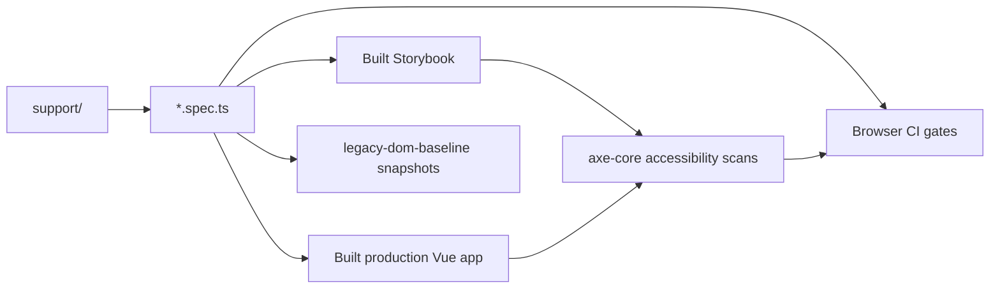

<!--
This file is part of DerridAI, a cELF-compliant research workspace
Copyright © 2026  Aaron John Schlosser, PhD

This program is free software: you can redistribute it and/or modify
it under the terms of the GNU Affero General Public License as
published by the Free Software Foundation, either version 3 of the
License, or (at your option) any later version.

This program is distributed in the hope that it will be useful,
but WITHOUT ANY WARRANTY; without even the implied warranty of
MERCHANTABILITY or FITNESS FOR A PARTICULAR PURPOSE.  See the
GNU Affero General Public License for more details.

You should have received a copy of the GNU Affero General Public License
along with this program.  If not, see <https://www.gnu.org/licenses/>.
-->

# Frontend browser and workflow tests

`web/tests/e2e/` contains Playwright suites for composed user workflows, production-app browser behavior, Storybook accessibility, and selected legacy characterization.

These tests are intentionally separate from Vitest because they verify browser-level composition, focus/keyboard behavior, scrolling, progressive loading, accessibility, and integration between multiple frontend surfaces.

## Execution model

## Suite families

The directory currently includes application-view/workflow coverage, Corpus Builder and review flows, Records/Search/Works, Pipeline Studio, Settings, progressive loading, operations, static-site export/accessibility, and the legacy DOM characterization baseline.

`support/` contains shared Playwright helpers. The legacy baseline snapshots are characterization records for imperative UI that has not yet been fully retired; when a surface is migrated to Vue, prefer deleting its obsolete baseline and asserting behavior rather than regenerating a snapshot to conceal the change.

## Rules

- Browser tests should represent user-observable workflows, not duplicate every Vitest assertion.
- Include keyboard and accessibility behavior when a change affects dialogs, menus, tables, navigation, or other interactive structure.
- Do not treat a passing screenshot/snapshot as proof of semantic correctness.
- Keep tests deterministic and isolate application state between scenarios.
- Add a focused browser regression when the failure depends on real layout, scrolling, routing, focus, or composed async behavior that happy-dom cannot represent reliably.

Run from `web/` with `npm run test:e2e`; focused workflow and accessibility commands are also available through the package scripts.
