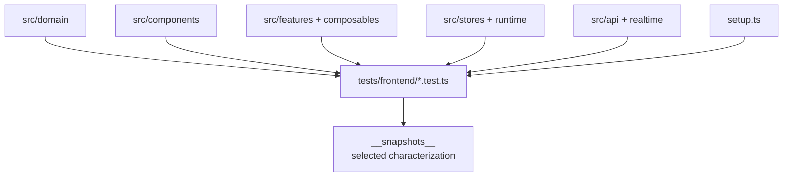

<!--
This file is part of DerridAI, a cELF-compliant research workspace
Copyright © 2026  Aaron John Schlosser, PhD

This program is free software: you can redistribute it and/or modify
it under the terms of the GNU Affero General Public License as
published by the Free Software Foundation, either version 3 of the
License, or (at your option) any later version.

This program is distributed in the hope that it will be useful,
but WITHOUT ANY WARRANTY; without even the implied warranty of
MERCHANTABILITY or FITNESS FOR A PARTICULAR PURPOSE.  See the
GNU Affero General Public License for more details.

You should have received a copy of the GNU Affero General Public License
along with this program.  If not, see <https://www.gnu.org/licenses/>.
-->

# Frontend Vitest suite

`web/tests/frontend/` contains the fast frontend regression suite built with Vitest, Vue Test Utils, and happy-dom. Files are named for the behavior or surface they exercise, so a developer can usually find the right test by matching the production concept.

## Coverage model

This directory includes more than narrowly defined unit tests: it also contains component, integration-like, contract-facing, and characterization coverage that still runs efficiently in the Vitest environment.

## Naming and placement

Use the production subject in the filename, for example `record-workspace.test.ts`, `pipeline-graph.test.ts`, or `metadata-schema.test.ts`. Domain-only helpers commonly use a `*-domain.test.ts` suffix, but the suffix is descriptive rather than a separate runner.

Prefer adding scenarios to an existing topical file over creating a release-specific regression file. Keep fixtures/fakes local unless several test domains genuinely share them.

## Test design

- Assert behavior and state transitions rather than source text or implementation trivia.
- Exercise accessibility semantics for reusable components where practical; browser-level axe coverage remains in `../e2e/`.
- Use snapshots only when they characterize a stable structure that is otherwise difficult to express. Do not expand snapshot coverage merely to make refactors convenient.
- Keep asynchronous/realtime tests deterministic; a test should not depend on an external API, Ollama, Chroma server, or GPU.
- When changing a component with a Storybook story, keep its Vitest behavior and Storybook state assumptions consistent.

Run from `web/` with `npm run test:unit`; repository CI may select dependency-related tests for a pull request.
